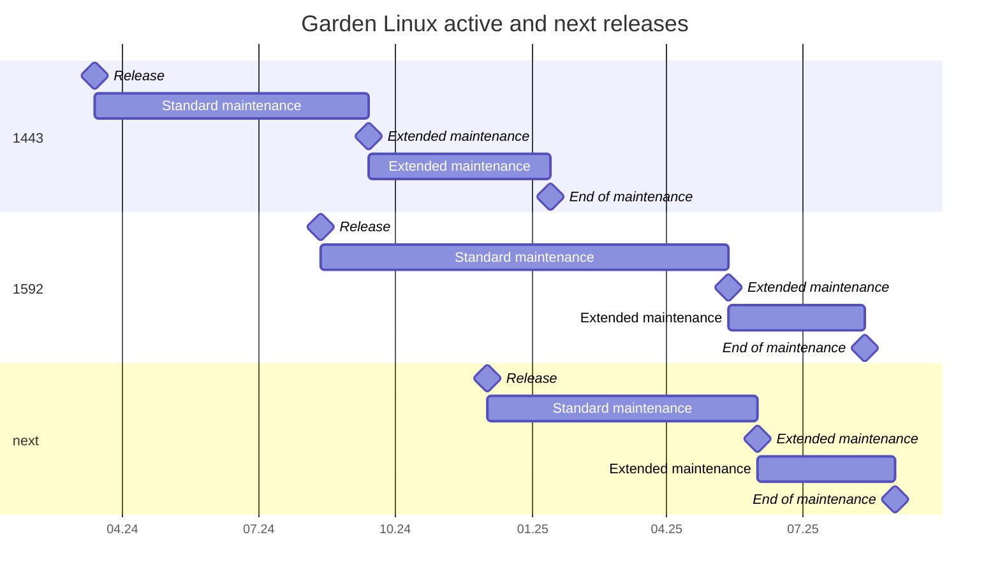

<p style="text-align: center;">
    <a href="https://github.com/gardenlinux/gardenlinux/releases" target="_blank">
       
    </a>
    <a href="https://github.com/gardenlinux/gardenlinux/actions/workflows/nightly.yml" target="_blank">
        
    </a>
    <a href="https://github.com/gardenlinux/gardenlinux/actions/workflows/dev.yml" target="_blank">
        
    </a>
    <a href="https://bestpractices.coreinfrastructure.org/projects/3925" target="_blank">
        
    </a>
  </p>
</p>

# Garden Linux

<website-main>

 <a href="https://gardenlinux.io/">Garden Linux</a> is a <a href="https://debian.org/">Debian GNU/Linux</a> derivate that aims to provide small, auditable Linux images for most cloud providers (e.g. AWS, Azure, GCP etc.) and bare-metal machines. Garden Linux is the best Linux for <a href="https://gardener.cloud/">Gardener</a> nodes. Garden Linux provides great possibilities for customizing that is made by a highly customizable feature set to fit your needs. <br><br>

</website-main>


## Features
- Easy to use build system
- Repeatable and auditable builds
- Small footprint
- Purely systemd based (network, fstab etc.)
- Initramfs is dracut generated
- Running latest LTS Kernel
- [MIT](https://github.com/gardenlinux/gardenlinux/blob/master/LICENSE.md) license
- Security
  - Fully immutable image(s) *(optional)*
  - OpenSSL 3.0 *(default)*
  - CIS Framework *(optional)*
- Testing
  - Unit tests (Created image testing)
  - Platform tests (Image platform tests in all supported platforms)
  - License violations (Testing for any license violations)
  - Outdated software versions (Testing for outdated software)
- Supporting major platforms out-of-the-box
  - Major cloud providers AWS, Azure, Google, Alicloud
  - Major virtualizer VMware, OpenStack, KVM
  - Bare-metal systems

# Build

The build system utilises the [gardenlinux/builder](https://github.com/gardenlinux/builder) to create customized Linux distributions.
[gardenlinux/gardenlinux](https://github.com/gardenlinux/gardenlinux) is maintained by the Garden Linux team, highlighting specialized "features" available for other projects.

> [!TIP]
> For further information about the build process, and how to set it up on your machine, refer to [the _Build Image_ documentation page](docs/01_developers/build_image.md).

To initiate a build, use the command:
```bash
./build ${platform}-${feature1}-${feature2}-${feature3}-${arch}
```

Where:

- `${platform}` denotes the desired platform (e.g., kvm, metal, aws). It should be the first part of the flavor that is built.
- `${featureX}` represents one or more specific features from the `features/` folder. Features are appended and seperated by a hyphen `-` or (if the feature starts with an underscore `_`) by an underscore.
- `${arch}` optinally you can reference a certain architecture `amd64` or `arm64`. It should be the last part of the flavor that is built.

You can combine multiple platforms and features as needed.

Examples:
```shell
./build kvm-python_dev
./build aws-gardener_prod-amd64
```

The build script fetches the required builder container and manages all internal build steps. By default, it uses rootless podman, but you can switch to another container engine with the `--container-engine` flag.

# Test

To run unit tests for a specific target, use the command `./test ${target}`.
Further documentation about tests is located in [tests/README.md](tests/README.md).

# Releases

For more information about the release strategy and lifecycle, have a look at the [Release Plan Overview](docs/00_introduction/release.md).

## Active and Next Releases



## Download Stable and Patch Releases

[Stable](docs/00_introduction/release.md#stable-releases) and [Patch](docs/00_introduction/release.md#patch-releases-patches) releases can be downloaded from the following sources:

| Product                        | Release Frequency | Download                                                                                        |
| ------------------------------ | ----------------- | ----------------------------------------------------------------------------------------------- |
| cloud and baremetal images | Quarterly         | [Download](https://github.com/gardenlinux/gardenlinux/releases)                                 |
| base container images      | Quarterly         | [Download](https://github.com/gardenlinux/gardenlinux/pkgs/container/gardenlinux)               |
| bare python container      | Quarterly         | [Download](https://github.com/gardenlinux/gardenlinux/pkgs/container/gardenlinux%2Fbare-python) |
| bare libc container        | Quarterly         | [Download](https://github.com/gardenlinux/gardenlinux/pkgs/container/gardenlinux%2Fbare-libc)   |
| bare nodejs container      | Quarterly         | [Download](https://github.com/gardenlinux/gardenlinux/pkgs/container/gardenlinux%2Fbare-nodejs) |

The cloud and baremetal images provided by Garden Linux are compatible with various cloud platforms, including Alibaba Cloud, AWS, Microsoft Azure and GCP.

## Download Nightly Releases 

[Nightly](docs/00_introduction/release.md#nightly-releases) releases can be downloaded from the same sources and are either tagged or named `nightly`.

> [!WARNING]  
> Nightly releases do not include maintenance commitments and never receive updates.
> Advanced users are invited to try them out and provide feedback, but it **is strongly discouraged** to use them in any sort of production environment.

# Nvidia Driver Support
An installer can be found in the [gardenlinux/gardenlinux-nvidia-installer](https://github.com/gardenlinux/gardenlinux-nvidia-installer) repository.

# Documentation
Please refer to [docs/README.md](https://github.com/gardenlinux/gardenlinux/tree/main/docs#readme).

# Contributing

Contributions to the Garden Linux open source projects are welcome. 
More information are available in in <a href="CONTRIBUTING.md">CONTRIBUTING.md</a> and our `docs/`.

# Community
If you need further assistance, have any issues or just want to get in touch with other Garden Linux users feel free to join our public chat room on Gitter.

Link: <a href="https://gitter.im/gardenlinux/community">https://gitter.im/gardenlinux/community</a>
