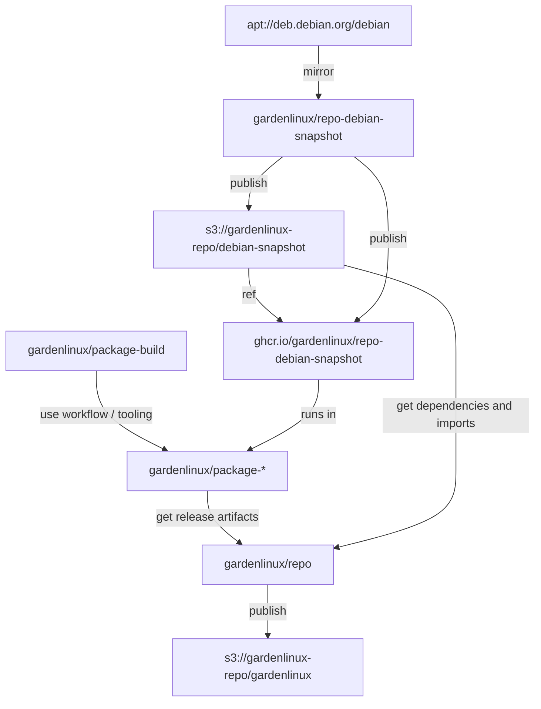

# Gardenlinux Repo Infrastructure



## GitHub

- `gardenlinux/repo`
	- collect packages from `package-*` repos, fetch all dependecies from debian snapshot and publish into an APT repo distribution
- [`gardenlinux/repo-debian-snapshot`](https://github.com/gardenlinux/repo-debian-snapshot)
	- regularly snapshot debian testing (needed for reproducible package and repo builds)
- [`gardenlinux/package-build`](https://github.com/gardenlinux/package-build)
	- tooling used by `package-*` repos to build binary debian packages
- [`gardenlinux/package-*`](https://github.com/gardenlinux?q=package-&type=all&language=&sort=)
	- repos for custom-built packages

## AWS

- bucket: `gardenlinux-repo`
	- `/pool` for all package files
	- `/gardenlinux` for gardenlinux release dists
	- `/debian-snapshot` for time stamp indexed debian testing snapshot dists
- cloudfront: `E2RAO851VDQ2KX`
	- proxies bucket `gardenlinux-repo` using lambda `repoPathRewrite` to fix problem with aws S3 http endpoint handling `+` in filenames incorrectly and redirects all requests for `/*/pool` to `/pool` => allowing to use a shared pool directory for gardenlinux repo and debian-snapshot
- role: `github-repo-oidc-role`
	- allows all actions running in an environment 'aws' from repos matching 'gardenlinux/repo-*' to access
- policy: `github-repo-policy`
	- gives read/write access to S3 bucket `gardenlinux-repo`
	- gives access to gardenlinux repo signing key on KMS

## Repo patch release workflow

The `update.yml` GitHub action automatically creates daily releases of the form `<GL_VERSION>.0`.
Each release corresponds to a tag of the same name in this repo.
These tags contain a generated file called `package-releases` that pins the custom build package versions to include in this release.

To create a patch release, simply checkout this tag, adjust the `package-release` and `package-imports` files as needed, commit and tag this commit as `<GL_VERSION>.X`

```
git fetch --tags
git checkout <GL_VERSION>.0
# modify package-releases and package-imports as needed
git commit
git tag <GL_VERSION>.1
git push origin <GL_VERSION>.1
```
