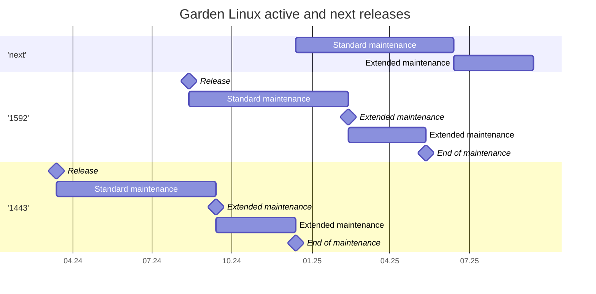

# Garden Linux Release Plan Overview

## Introduction

On this page you will learn about the Garden Linux releases and their lifecycle.

### Stable releases

You can expect up to four Garden Linux stable releases per year, published up to once per quarter. Each new stable release (e.g., "1443" or "stable-1443" or "release 1443") introduces major changes like updated versions of software packages or libraries. The initial stable release is designated as "patch 0" (e.g., "1443.0" or "patch-1443.0" or "initial release 1443"), establishing the initial frozen codebase. During the nine-month maintenance period, updates are provided as release patches (e.g., "1443.1" or "patch-1443.1" or "patch 1 of release 1443"). Each stable release progresses through the following maintenance phases:

- **Standard maintenance** starts with the publishing of a new stable release and continues for six months. In this phase active maintenance is performed on the stable release. You can expect regular patch releases including _(but not limited to)_ fixes for issues, updates to higher minor release of selected software packages and libraries included, proactive monitoring & assessment of security vulnerabilities, performance corrections and enhancements and more. General best practice is to always use the latest patch of the latest release.

- **Extended maintenance** starts after the standard maintenance phase and continues for three months. In this phase only [Common Vulnerabilities and Exposures (CVE)](https://csrc.nist.gov/glossary/term/common_vulnerabilities_and_exposures) with high and critical (7.0-10.0) severity according to the [Common Vulnerability Scoring System (CVSS)](https://nvd.nist.gov/vuln-metrics) are patched. For more details refer to the [Garden Linux Security Response Process](/SECURITY.md). This enables users to have sufficient time to plan and execute their transition to latest release in standard maintenance.

- **End of maintenance** is reached nine months after the initial stable release has been published. In this phase no further planned maintenance activities are performed. Adopters can continue to use the stable release at their own risk. Users can request an exceptional patch release via a GitHub issue in [gardenlinux](https://github.com/gardenlinux/gardenlinux/issues/new/choose). There is no guarantee the request will be served - maintainers reserve the right to reject the request and fix-forward only in the latest stable release that is in standard maintenance due to the complexity involved with producing a patch release for very old stable release.

### Patch releases _("patches")_

During the nine-month maintenance period, updates are provided as patch releases (e.g., "1443.1" or "patch-1443.1" or "patch 1 of release 1443"). "Patches" are considered stable, and adopters are encouraged to always use the latest patch release of the latest stable release. Patch releases can be expected to adhere to following rules:

- Can include higher minor versions of software packages or libraries already included in the stable release.
- Can include security enhancements related to vulnerabilities identified after the release of the previous patch.
- Can remove in rare (exceptional) situations software packages or libraries (e.g. due to security or legal risk identified after the release was published.). Such changes are documented in the release note. 

### Nightly releases 

Every night, a new build is triggered via the GitHub Action [Nightly Build](https://github.com/gardenlinux/gardenlinux/actions/workflows/nightly.yml) (e.g., "nightly-1660.0"). You can monitor their status publicly on the action page. The maintainers aim to have a successful build every 24 hours. Occasionally, there might be nightly patches (like "nightly-1660.1") released if the initial nightly build requires urgent fixes. Nightly releases contain the latest software packages and are geared toward rapid iterations for advanced stakeholders interested in cutting-edge changes. However, they are not guaranteed to be as stable or as thoroughly maintained and tested as the stable releases. Nightly releases do not include maintenance commitments and are therefore not recommended for production environments. Up to once per quarter, a nightly release is promoted to a stable release and is then supported with nine months of standard maintenance.

### Next Release

The "next" release is a projection of the upcoming stable release. It exists primarily to give users an idea of when the next stable version **might** be released and how long it **might** be supported.

## Schedule

### Active maintenance

In this section you can find more about the releases that are currently actively maintained and receive maintenance by the Garden Linux Maintainers team.

Garden Linux strives to balance providing cutting edge version of the relevant software packages and libraries, with enabling adopters to benefit from stable and sufficiently long maintenance phases reducing maintenance efforts. Therefore, a user can expect up to four releases every year, published maximum once per quarter. Each release goes through the phases listed in the [Introduction](#introduction) section.

**Current schedule:**

| Release                                                                   | Release date  | Extended maintenance  | End of maintenance    |
| -                                                                         | -             | -                     | -                     |
| next                                                                      | Dec 2024      | Jun 2025              | Sept 2025             |
| [1592](https://github.com/gardenlinux/gardenlinux/releases/tag/1592.0)    | 12.08.2024    | 12.08.2025            | 12.05.2025            |
| [1443](https://github.com/gardenlinux/gardenlinux/releases/tag/1443.0)    | 13.03.2024    | 13.09.2024            | 13.03.2024            |

\* Release in progress.

### Out of maintenance releases (archive)

In this section you can find more about the releases that are already out of maintenance and considered archived with no further maintenance expected. Only deviation could arise in an exceptional and extraordinary situation, which would require special agreement between the Garden Linux Maintainers and specific adopter. In general, if you are using a version listed below, you are encouraged to migrate as soon as possible to latest release in standard maintenance. 

| Release                                                                   | Release date  | Extended maintenance  | End of maintenance    |
| -                                                                         | -             | -                     | -                     |
| [1312](https://github.com/gardenlinux/gardenlinux/releases/tag/1312.0)    | 03.11.2023    | 03.05.2024            | 03.08.2024            |
| [934](https://github.com/gardenlinux/gardenlinux/releases/tag/934.0)      | 05.06.2023    | 05.12.2023            | 05.03.2024            |
| [576](https://github.com/gardenlinux/gardenlinux/releases/tag/576.0)      | 17.11.2021    | 17.05.2023            | 17.08.2023            |
| [318](https://github.com/gardenlinux/gardenlinux/releases/tag/318.4)      | 28.04.2021    | 28.10.2021            | 28.01.2023            |
| [184](https://github.com/gardenlinux/gardenlinux/releases/tag/184.0)      | 29.10.2020    | 29.04.2020            | 29.07.2021            |
| [27](https://github.com/gardenlinux/gardenlinux/releases/tag/27.0)        | 09.06.2020    | 09.12.2020            | 09.03.2021            | 

## Dictionary

To ensure common understanding of the terms involved, the terms used throughout the document are defined in this section.
- **Release** is used in the context of Garden Linux and referse to the process of publishing a new stable version of the Linux distribution.
- **Standard maintenance** is used in the context of Garden Linux releases, it refers to the initial six-month window after the release of new version of Garden Linux. 
- **Extended maintenance** is used in the context of Garden Linux releases, it refers to the three-month window after the end of standard maintenance.
- **End of maintenance** is used in the context of Garden Linux releases, it refers to the date on which the extended maintenance ends.
