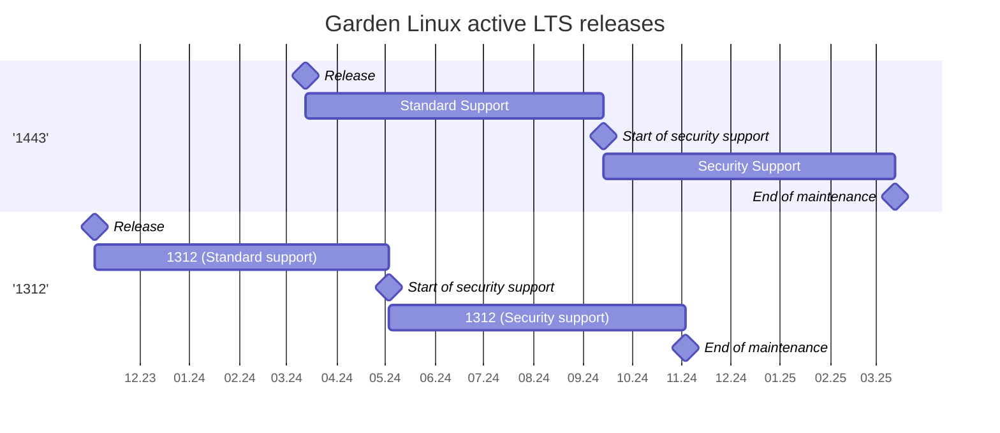

# Garden Linux Releases

## Introduction

On this page you will learn about the Garden Linux releases and their lifecycle. 
Following releases are available: 
- **Long Term Support (LTS)**. Includes major changes to the distribution and is produced quarterly or four times per year. It may include incompatible changes related to exchange of packages, libraries or configurations. It is recommended to adopt in production always the latest LTS release in maintenance to get the most up-to-date packages and support. *(e.g. 1443.0)*
- **LTS patch release**. Includes only compatible changes within the context of their LTS release and is usually available monthly. You can expect fixes to reported issues or security enhancements. It is recommended to always update to latest patch release for the LTS release you are using. *(e.g. 1443.1)*
- **Nightly release**. Includes latest changes and latest stable version of the packages. It is geared towards advanced adopters interested in trying out latest changes before they are available to broader audience. It is not recommended for production usage.

## Long-term support (LTS) releases

### LTS releases in active maintenance

In this section you will learn about the releases that are currently actively maintained and receive support by the Garden Linux Maintainers team.

You can expect a new LTS release every three months (quarterly) or four times per year. By default, the two newest LTS releases are in standard maintenance for six months after their initial release date. After that, they transition for next six months to security maintenance. This enables the LTS adopters to get up to a year of stability on each LTS released by the team, while being encouraged to transition timely to the latest patch of the latest LTS release.

| Release   | Release date  | Security Support  | End of support    |
| -         | -             | -                 | -                 |
| next      | 13.09.2024    | -                 | -                 |
| 1443      | 13.03.2024    | 13.09.2024        | 13.09.2024        |
| 1312      | 03.11.2023    | 16.05.2024        | 13.09.2024        |

### LTS releases out of maintenance (archived)

Below you can find information about the releases that are out maintenance. This means that there will be no further patch or security maintenance work related to them. Only deviation could be if there is an exceptional, extraordinary situation which would require special agreement between the Garden Linux Maintainers and an adopter.  

| Release   | Release date  | Security Support  | End of support    |
| -         | -             | -                 | -                 |
| 934       | 21.10.2022    | 21.04.2023        | 21.10.2023        |
| 576       | 28.10.2021    | 28.04.2022        | 28.10.2022        |
| 318       | 12.10.2021    | 12.04.2022        | 12.10.2022        |
| 186       | 03.01.2020    | 03.07.2020        | 03.01.2021        |
| 27        | 27.04.2020    | 27.10.2020        | 27.04.2021        | 

## LTS patch releases

During the standard and security support phases of an LTS release, the maintainers produce patch releases. They are considered stable, and adopters are encouraged to always consider using the latest patch of the latest LTS release when possible. LTS patch releases can be expected to adhere to following frame:

- Can include newer (higher) minor versions of packages already included in the LTS release.
- Can include security enhancements related to vulnerabilities identified after the release of the previous patch.
- May exceptionally in rare situations remove packages or libraries (e.g. security or legal risk). Such changes are documented in the release note. 

## Nightly releases (Experimental)

The nightly releases are triggered every night via the GitHub Action [Nightly Build](https://github.com/gardenlinux/gardenlinux/actions/workflows/nightly.yml). Their status can be monitored publicly in the action. The maintainers are ensuring that every 24h there is a successful build. It contains latest packages, aiming at rapid iterations for advanced stakeholders interested in the cutting-edge changes, but is not guaranteed to be always stable and as maintained/tested as the LTS releases.

Once per quarter, based on the LTS release schedule, a daily release is promoted to LTS release and accepted for up to one year of support.

## Dictionary

To ensure common understanding of the terms involved, the terms used throughout the document are defined in this section.

- LTS: Long-term support. Used in the context of Garden Linux releases. Refers to an official production ready release.

- Standard maintenance: Refers to the six-month window after the initial release in which the release receives regular patches addressing issues raised by adopters or security enhancements identified by the maintainers while actively monitoring relevant information sources and vulnerability reports.

- Security maintenance: Refers to the six-month window after the end of the standard maintenance window. At this stage, only [Common Vulnerabilities and Exposures (CVE)](https://csrc.nist.gov/glossary/term/common_vulnerabilities_and_exposures) with high and critical (7.0-10.0) severity according to the [Common Vulnerability Scoring System (CVSS)](https://nvd.nist.gov/vuln-metrics) are patched. For more details refer to the [Garden Linux Security Response Process](/SECURITY.md).