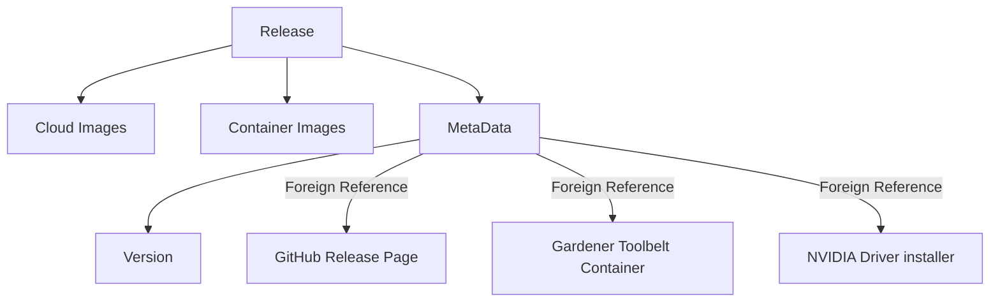
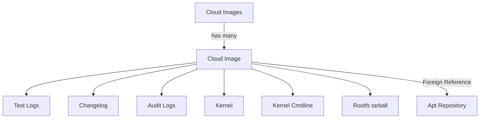
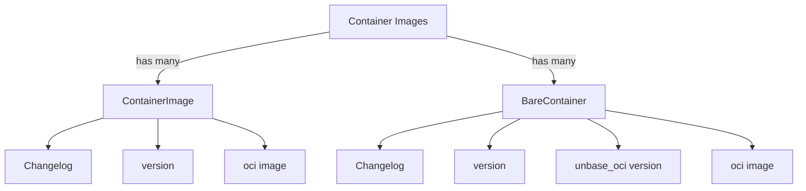

# High Level Design: Component Modelling of Garden Linux Ecosystem

Garden Linux has a diverse ecosystem, comprising cloud and container images, apt repositories, and essential tools like the container toolbelt and NVIDIA driver installer. 

Each release within the Garden Linux ecosystem is accompanied by multiple artifacts. 
These artifacts are made easily discoverable and automatically consumable through an registry.
This registry contains self-referencing links to related artifacts and adheres to a defined general structure, which is detailed in the following section.

## Garden Linux Ecosystem Components

The following sections and diagrams are an abstract representation of artefacts within the OCI registry,
showing the relations between OCI Artefacts and URLs to foreign resources.

### Release Component
Each release creates multiple products within the Garden Linux ecosystem. 
In the following diagrams, we do not specify how the information is encoded (e.g. version as tags, or metadata as a json file),
we only show what information is relevant and how it is related within the Garden Linux Ecosystem.

### Cloud Image Component 
`CloudImages` is an abstract entity that references `CloudImage` objects for each supported cloud platform.
`CloudImages` does not necesarily have to be implemented as an object, it can also be a simple list.
The `CloudImage` type defines data for a single cloud image.

### Container Images Component

Multiple container images for different purposes exist.
The structure `ContainerImages` is an abstract entity, that can also be implemented as a list of the Release object.

# Implementations

This high level design describes the general structure and corelation between Garden Linux components.

## Pure OCI Implementation
See [OCI Implementation specification](oci-implementation-specification.md) for details.

## OCM Implementation 

See [OCM Implementation specification](ocm-implementation-specification.md) for details.

## OCI+OCM hybrid Implementation 

Easy to achieve, since OCM can reference artefacts from any other OCI registry. 
If OCI Implementation is selected as first target, a follow up OCM implementation can reference those 
OCI artefacts.

