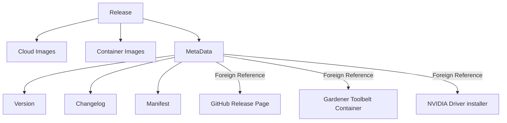
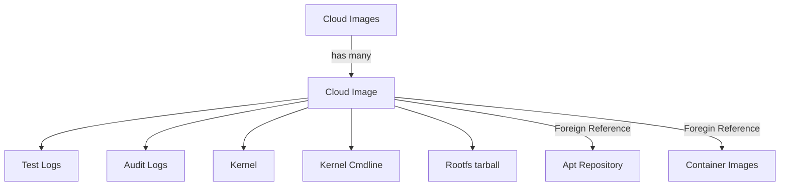
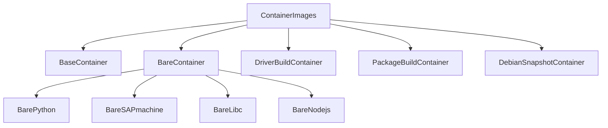

# Releases

Garden Linux has a diverse ecosystem, comprising cloud and container images, apt repositories, and essential tools like the container toolbelt and NVIDIA driver installer. 

Each release within the Garden Linux ecosystem is accompanied by multiple artifacts. 
These artifacts are made easily discoverable and automatically consumable through an OCI registry. 
This OCI registry contains self-referencing links to related artifacts and adheres to a defined general structure, which is detailed in the following section.

## OCI Artefact Overview

The following sections and diagrams are an abstract representation of artefacts within the OCI registry,
showing the relations between OCI Artefacts and URLs to foreign resources.

### Release
Each release creates multiple products within the Garden Linux ecosystem. 

### Cloud Images 
`CloudImages` is an abstract object that references `CloudImage` objects for each supported cloud platform.
`CloudImages` does not necesarily have to be implemented as an object, it can also be a simple list.
The `CloudImage` type defines data for a single cloud image.

### Container Images

Multiple container images for different purposes exist.
The structure `ContainerImages` is the entry point to discover all available containers for a release.

# Implementations

## Pure OCI Implementation
See [OCI Implementation specification](oci-implementation-specification.md) for details.

## OCM Implementation 

See [OCM Implementation specification](ocm-implementation-specification.md) for details.

## OCI+OCM hybrid Implementation 

Easy to achieve, since OCM can reference artefacts from OCI. 
If OCI Implementation is selected as first target, a follow up OCM implementation can reference those 
OCI artefacts.

