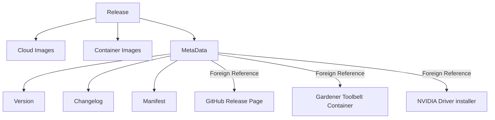
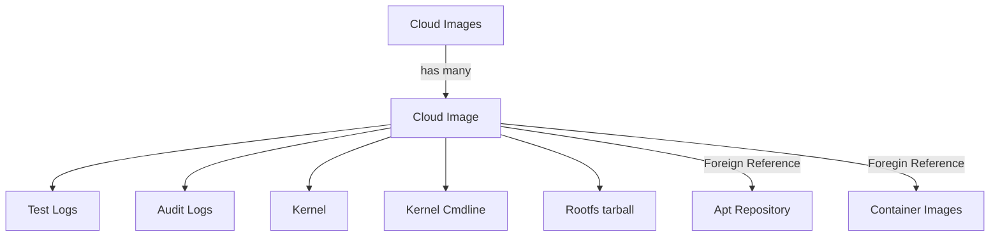
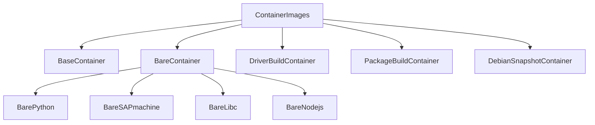

# Releases

Garden Linux has a diverse ecosystem, comprising cloud and container images, apt repositories, and essential tools like the container toolbelt and NVIDIA driver installer. 

Each release within the Garden Linux ecosystem is accompanied by multiple artifacts. 
These artifacts are made easily discoverable and automatically consumable through an OCI registry. 
This OCI registry contains self-referencing links to related artifacts and adheres to a defined general structure, which is detailed in the following section.


## OCI Artefact Overview

The following sections and diagrams are an abstract representation of artefacts within the OCI registry,
showing the relations between OCI Artefacts and URLs to foreign resources.

### Release
Each release creates multiple products within the Garden Linux ecosystem. 



### Cloud Images 
`CloudImages` is an abstract object that references `CloudImage` objects for each supported cloud platform.
`CloudImages` does not necesarily have to be implemented as an object, it can also be a simple list.
The `CloudImage` type defines data for a single cloud image.





### Container Images

Multiple container images for different purposes exist.
The structure `ContainerImages` is the entry point to discover all available containers for a release.




## Reference by tag

Each OCI artefact has a unique digest, which looks like `sha256:12340abcdef`. 
Objects described in the sections and diagrams above also have digests. 
This is not very practical if we want to automate or manually discover the Garden Linux ecosystem. 
Therefore we assign tags to each object. 

Every artifact within the OCI registry is identified by a unique digest (e.g. `sha256:12340abcdef`). 
This applies to all objects described in the sections and diagrams described in chapter [OCI Artefact Overview](#oci-artefact-overview).
To enable automation and discoverability, we also allocate tags to each object. 

Using oras as client, one can download an artefact by referencing a tag
```
oras pull <registry>/release/1443.1/cloudimages/ali/kernel.tar.xz:v1
```

This can easily be integrated in automation, for example to always reference the latest LTS version of Garden Linux.


## OCI Artefact structure

An OCI artifact is described by a manifest,
which is a JSON document detailing the artifact's components,
including their digests and references to other OCI artefacts or URLs to foreign resources.


# Implementations


## Pure OCI Implementation
See [OCI Implementation specification](oci-implementation-specification.md) for details.

## OCM Implementation 

See [OCM Implementation specification](ocm-implementation-specification.md) for details.


## OCI+OCM hybrid Implementation 


See [Hyprid Implementation specification](hybrid-implementation-specification.md) for details.
