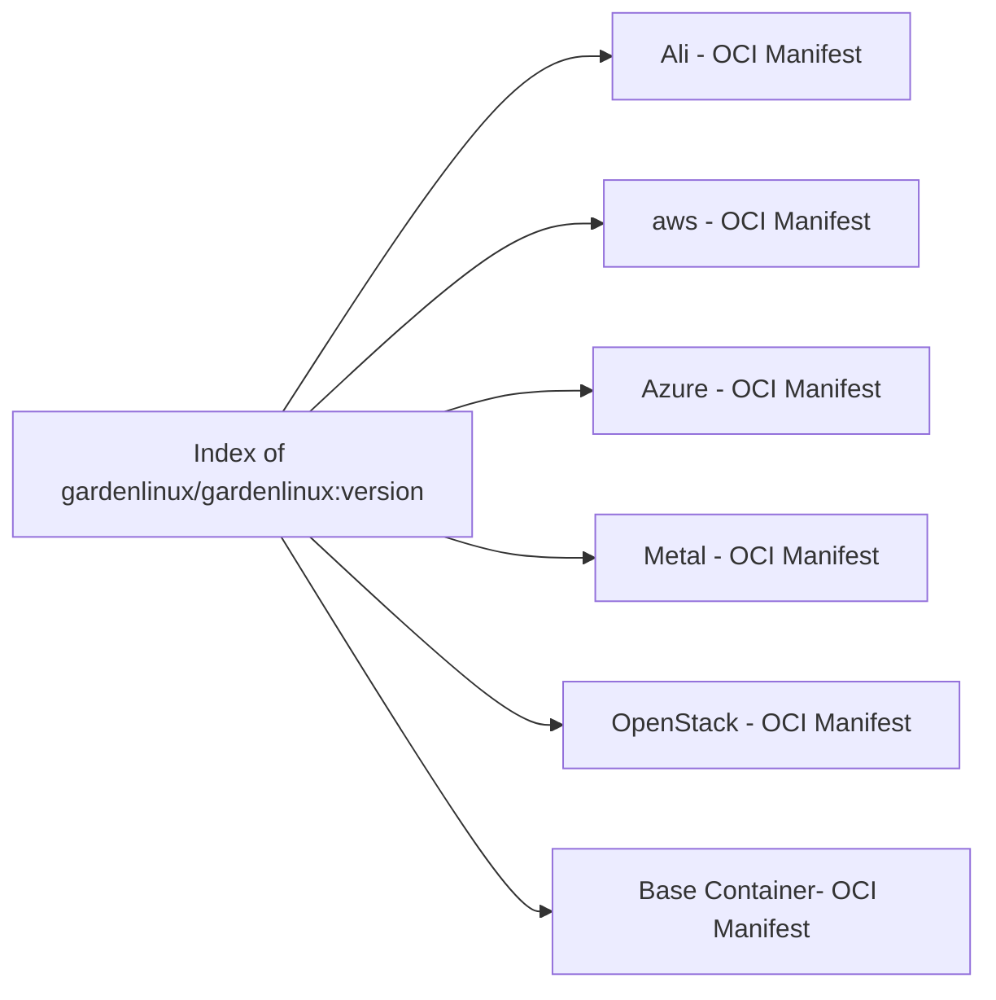
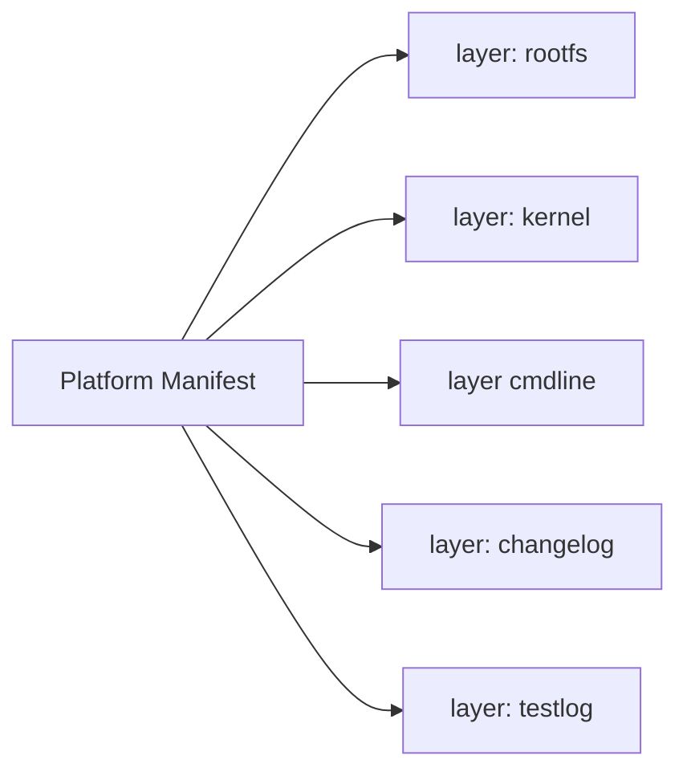
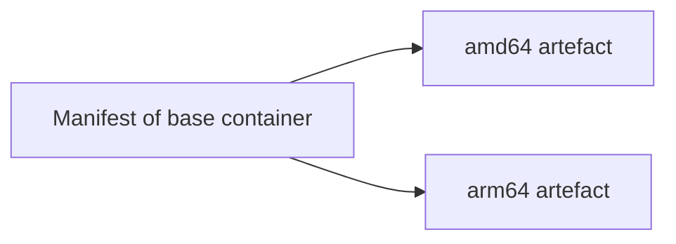

# OCI Implementation Specification


## Implementation Details

The [oci image-spec](https://github.com/opencontainers/image-spec) describes the standardized oci image format. 
We utilize this specification to upload any Garden Linux artefact as we design. 

The following sub-sections describe how we utilize the oci-image format to achieve the concepts mentioned above to implement the structure defined in the [HLD](high-level-design).


### Index



### Cloud images
The index described previously links all supported Garden Linux image platform manifests, where a platform manifest is structured as described in the following diagram:




### Base Container

Podman/Docker clients understand the index and find the Base Container manifest. 
This enables users to use podman/docker and use the OCI package just as they would use any other oci image.
```
podman pull ghcr.io/gardenlinux/gardenlinux:1443.3
```




## Links
* [oci image spec: layer](https://github.com/opencontainers/image-spec/blob/main/layer.md)
* [oci image spec: manifest](https://github.com/opencontainers/image-spec/blob/main/manifest.md)
* [oci image spec: annotations](https://github.com/opencontainers/image-spec/blob/main/annotations.md)
* [oci image spec: descriptors](https://github.com/opencontainers/image-spec/blob/main/descriptor.md)


