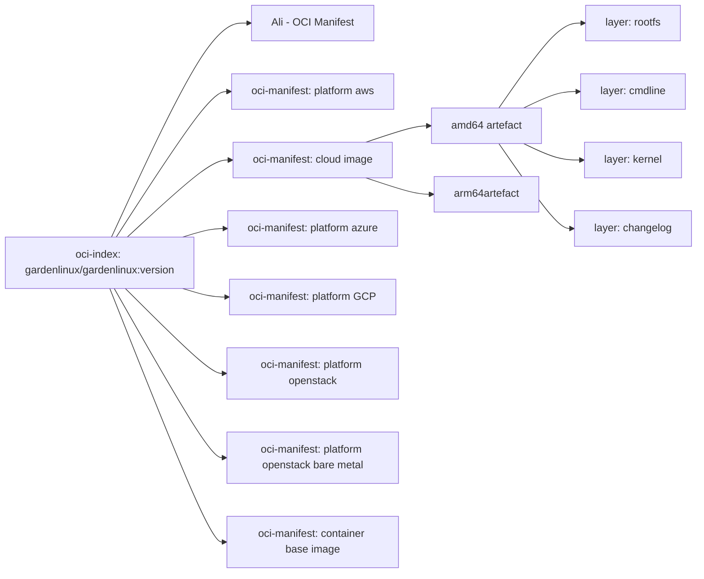

# OCI Implementation Specification


## Implementation Details

The [oci image-spec](https://github.com/opencontainers/image-spec) describes the standardized oci image format. 
We utilize this specification to upload any Garden Linux artefact as we design. 

The following sub-sections describe how we utilize the oci-image format to achieve the concepts mentioned above to implement the structure defined in the [HLD](high-level-design).

## Graph Overview
The following diagram shows the general hierachical structure of the OCI registry. We will go through each component and its implementation details in respective sub-sections in this document.



### Component: oci-index

We utilize the oci-index to reference all garden linux platforms, including various cloud platforms, metal and container images.
Additionally to the list of manifests referencing all supported platforms, the oci-index can have annotations. 


| oci-index property Name  | Property Value                               | Property Description                                                                                       |
|----------------|----------------------------------------------|-------------------------------------------------------------------------------------------------------------|
| `schemaVersion`| `2`                                          | This is REQUIRED to bne set to `2`.                                                                        |
| `mediaType`    | `application/vnd.oci.image.index.v1+json`    | Sets the type to be an oci index                                                                           |
| `manifests`    | See table [index manifests](#index-manifests)                    | Array of Manifests of mediatype manifest or (potentially) index. Each object in this array includes a set of descriptor propteries. |
| `annotations`  | See table  [index-annoations](#index-manifest-annotations) | An optional set of key-value pairs for additional metadata about the image index.                          |


#### oci-index property: manifest list

The oci-index contains an array of manifests, where each manifest object in that array contains the following information described in the table below.
Please note that these properties are for the list object, not the oci-manifest properties. The oci-manifest properties are described later.

| Manifest Object Property Name            | Property Value                           |
|--------------------------|------------------------------------------|
| `mediaType`              | See Platform Media Types                 |
| `platform`               | Object                                   |
| `platform.architecture`  | CPU architecture type              |
| `platform.variant`       | CPU architecture variant [see](https://github.com/opencontainers/image-spec/blob/main/image-index.md#platform-variants)                       |
| `platform.os`            | Garden Linux                             |
| `platform.os.version`    | Full Garden Linux Version                |
| `platform.os.features`   | NOT USED by Garden Linux.             |
| `platform.features`      | NOT USED by Garden Linux              |
| `annotations`            | See list of index-manifest-annotations  |


#### oci-index property: manifest-annotations 

| Key                       | Value                     |
|---------------------------|---------------------------|
| `org.opencontainers.image.version` | Garden Linux Version                 |
| `org.opencontainers.image.title`   | Garden Linux cname (may change, cname just as a description for humans)       |
| `org.opencontainers.image.description` | Short description  |
| `org.opencontainers.image.authors` | `@gardenlinux/garden-linux-maintainers` |
| `org.gardenlinux.cname`            |  Garden Linux cname (can be used for automation)        |
| `org.gardenlinux.builder.version`  | Reference to builder version        |
| `org.gardenlinux.apt.version`  | Reference to apt repository version (the apt distribition used)  |


See also [oci image spec: image-index](https://github.com/opencontainers/image-spec/blob/main/image-index.md)

### oci-manifest: Cloud Platform Manifest
A Garden Linux image can come in different CPU architecture types.
The platform manifest lists all architecture specific oci images for a given platform. 


See also [oci image spec: manifest](https://github.com/opencontainers/image-spec/blob/main/manifest.md)
### oci-image:  Cloud Image


| Property Name      | Property Value                          |
|--------------------|-----------------------------------------|
| `schemaVersion`    | 2 |
| `mediaType`        | MIME type string                        |
| `config`           | Object                                  |
| `config.mediaType` | String                                  |
| `config.size`      | Integer                                 |
| `layers`           | Array of layer objects                  |
| `layers[].mediaType` | String                                |
| `layers[].size`      | Integer                               |
| `annotations`      | See list of manifest-annotations  |


#### oci-image property: annotations

### Image - Container

Podman/Docker clients understand the index and find the Base Container manifest. 
This enables users to use podman/docker and use the OCI package just as they would use any other oci image.
```
    podman pull ghcr.io/gardenlinux/gardenlinux:1443.3
```


## Links
* [oci image spec: layer](https://github.com/opencontainers/image-spec/blob/main/layer.md)
* [oci image spec: manifest](https://github.com/opencontainers/image-spec/blob/main/manifest.md)
* [oci image spec: annotations](https://github.com/opencontainers/image-spec/blob/main/annotations.md)
* [oci image spec: descriptors](https://github.com/opencontainers/image-spec/blob/main/descriptor.md)


