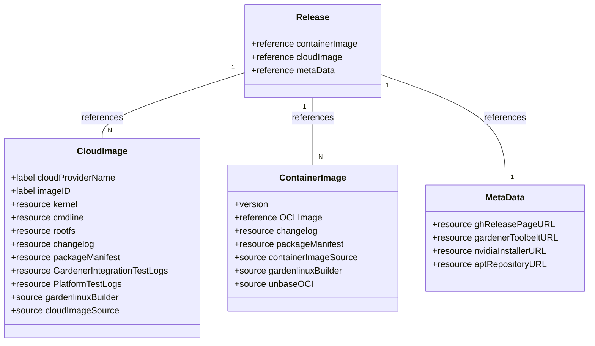

# OCM Implementation Specification

## GitHub Integration

## Security Tracker Integration
 

## OCM Mapping

This section defines how Garden Linux utilizes the 
OCM data structures defined in [schema-v2](https://ocm.software/docs/cli/spec/spec/schema-v2.html) of the ocm.software project.

### General Overview

Please see [HLD](high-level-design.md) for a structural overview. The following sections describe the details of each component, 
and it is assumed that the reader is familiar with the general structure of the HLD.

Each attribute of a class in the class diagrams below corresponds to a OCM field from the ocm schema v2.

### Class Diagram

### MetaData

### CloudImage

### ContainerImage

