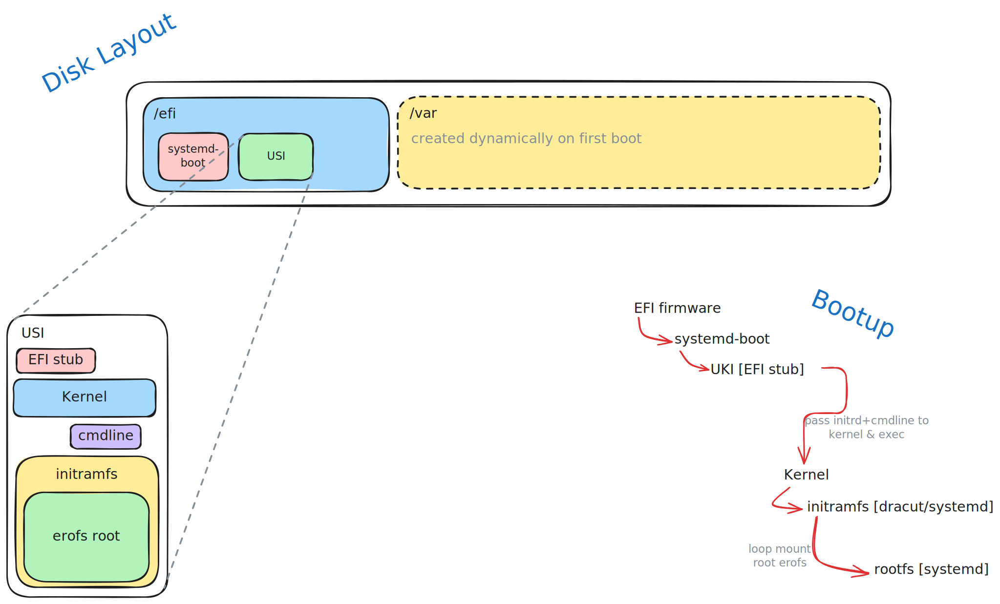
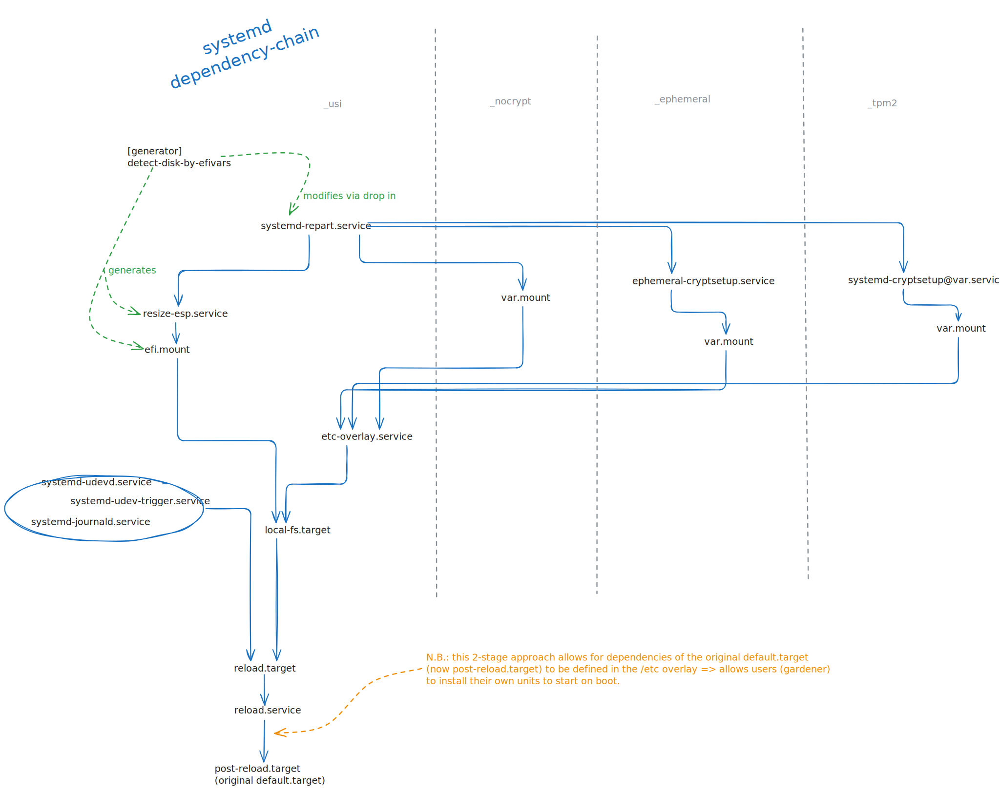

# GardenLinux Boot Modes :potted_plant::penguin:

GardenLinux supports two primary boot modes: Legacy and Unified System Image (USI).

Legacy is the traditional way most Linux distros boot and also how all GardenLinux versions prior to 17?? used to boot.
Legacy boot images are dual mode images, working both with UEFI boot and BIOS boot.

USI mode is a novel approach, where the entire system gets embedded into a single UKI binary.
This brings several advantages, such as allowing for in-place updates and enhanced security, but is only compatible with UEFI boot.

|                          | USI                | Legacy             |
|--------------------------|--------------------|--------------------|
| UEFI boot                | :white_check_mark: | :white_check_mark: |
| BIOS boot                | :x:                | :white_check_mark: |
| secureboot / trustedboot | :heavy_check_mark: | :x:                |
| in-place updates         | :white_check_mark: | :x:                |
| TPM 2.0 disk encryption  | :heavy_check_mark: | :x:                |

*( :heavy_check_mark: = optional )*

> [!TIP]
> If you are unsure which mode to pick: go for the *trustedboot* images, these are USIs with all optional security features enabled.

## Legacy

Legacy boot mode uses a standard partition layout.
There is a boot partition, used both by syslinux for BIOS boot and systemd-boot for UEFI boot.
The rootfs is on a simple ext4 partition, it is fully mutable.

Legacy mode does not attempt to provide any protection against offline attacks.

```shell
# example disk layout for legacy mode

vda                                                                         
├─vda1
│    vfat   FAT32 EFI   C1FE-FA19                                28M    67% /efi
└─vda2
     ext4   1.0   ROOT  aea6d56e-a2bf-944c-78fe-184a4d6add9f   29.1G     2% /
```

## Unified System Image (USI)

The design is loosely inspired by Lennart Poettering's ideas[^1] on how modern operating systems should boot.
We also fully embrace Unified Kernel Images (UKIs)[^2] and we also make use of an immutable root filesystem.
However, the design differs in how the root filesystem is verified.

In Lennart Poettering's design, the root (or just the `/usr` partition) is stored on a dm-verity disk; the root hash of the dm-verity Merkle tree is then embedded into the UKI.
While this design works well, it does add quite a bit of complexity.
It requires at least three partitions (more if you want in-place updates with A/B partitions): EFI system partition, root dm-verity data partition, and root dm-verity hash tree partition.

Due to the incredibly small footprint of our root partition, we can afford to go a different route: we can embed the entire root filesystem into the UKI.
This is done by packing the root filesystem into an EROFS image, which gets embedded into the initrd.

This UKI with an embedded rootfs is what we call a USI.

Loop mounting an EROFS in this way implies we have a fully immutable rootfs by default.
This has the added benefit of significantly simplifying the operation of the initrd.
It no longer needs to detect devices or disks; instead, the job of the initrd is now only to loop mount the embedded EROFS and pass control to it.

<picture>
<source media="(prefers-color-scheme: dark)" srcset="./.media/usi_disk_layout_dark.svg">

</picture>

### Mutable Data

While an immutable root filesystem provides good security guarantees, it prohibits a lot of operations.
Most systems running on Garden Linux require some form of writable state, usually under `/var`.
Therefore, we mount `/var` as writable.
To allow for modifications in `/etc` we create an overlay mount on top of `/etc`.
This overlay is backed by `/var/etc.overlay`.

For writable `/var`, there are multiple possible modes of operation:

- `_nocrypt`: In this mode, `/var` is simply backed by a plain ext4 partition, this is the default.
- `_ephemeral`: In this mode, a clean partition is created on each boot and encrypted with a per-boot random key.
- `_tpm2`: In this mode, the partition is created on first boot and encrypted with a key stored in the machine's TPM 2.0 device.
  This TPM secret is bound to the machine's secureboot state (PCR 7), so it will only allow decryption on subsequent boots if the secureboot certificate chain remains unchanged.
  This mode should only be used in conjunction with the [`_trustedboot` feature](#trustedboot).

In all of these modes of operation, the creation of the `/var` partition is handled by `systemd-repart`, and it automatically uses the available space on whichever disk the ESP is on.

|                                    | `_nocrypt`         | `_ephemeral`       | `_tpm2`            |
|------------------------------------|--------------------|--------------------|--------------------|
| persistent data                    | :white_check_mark: | :x:                | :white_check_mark: |
| protection against offline attacks | :x:                | :white_check_mark: | :white_check_mark: |
| works without TPM 2.0 device       | :white_check_mark: | :white_check_mark: | :x:                |

### Under the Hood

<picture>
<source media="(prefers-color-scheme: dark)" srcset="./.media/usi_systemd_dependency_chain_dark.svg">

</picture>

# Trustedboot

Trustedboot is an extension of secureboot, extending the security guarantees provided by secureboot to the entire boot chain.
While secureboot only validates the authenticity of the bootloader and kernel, Trustedboot also ensures the integrity of the root filesystem.

With USI boot we can gain this security almost for free. Due to the rootfs being embedded into the USI, signing this is all that's required.

> [!NOTE]
> Trustedboot is implemented on top of USI boot mode, so enabling it will automatically switch to USI boot mode.
> Trustedboot is incompatible with the `_nocrypt` storage mode. In Trustedboot the default is changed to `_ephemeral`; if persistence is required `_tpm2` must be used.


[^1]: https://0pointer.net/blog/fitting-everything-together.html
[^2]: https://uapi-group.org/specifications/specs/unified_kernel_image/
