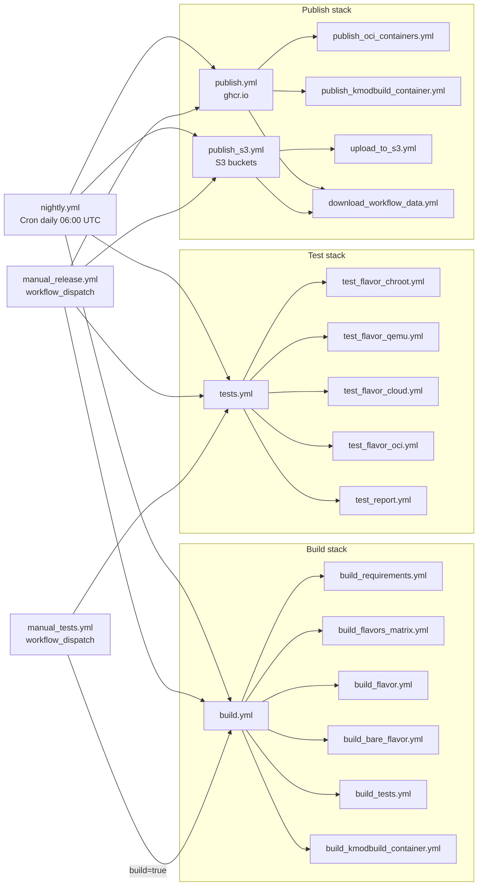
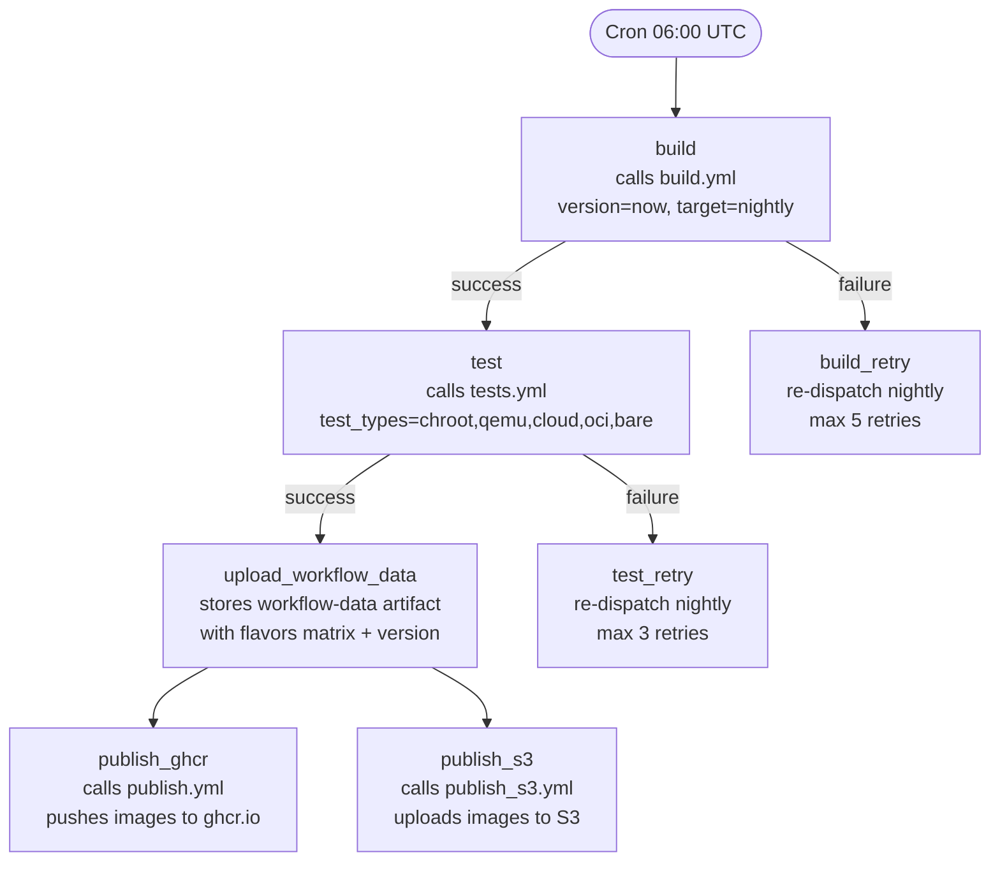
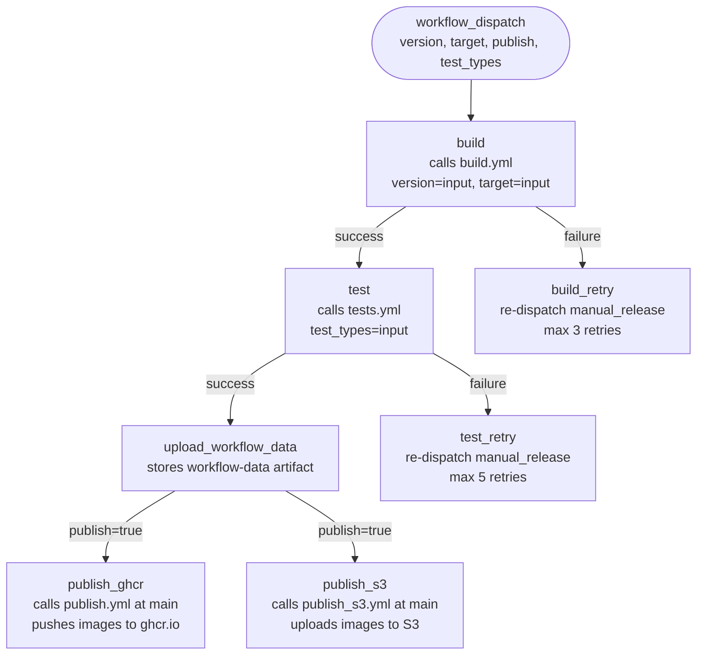
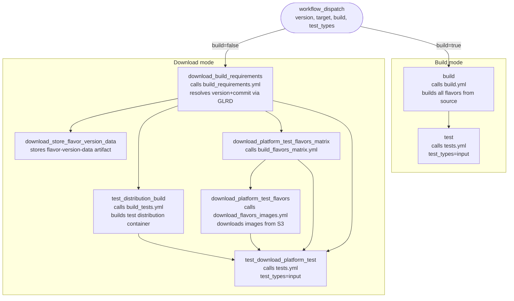
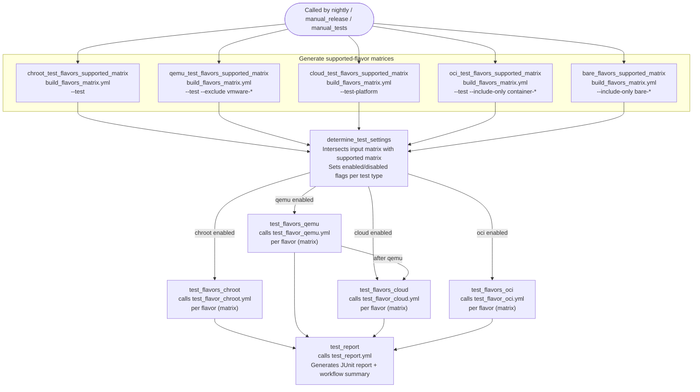
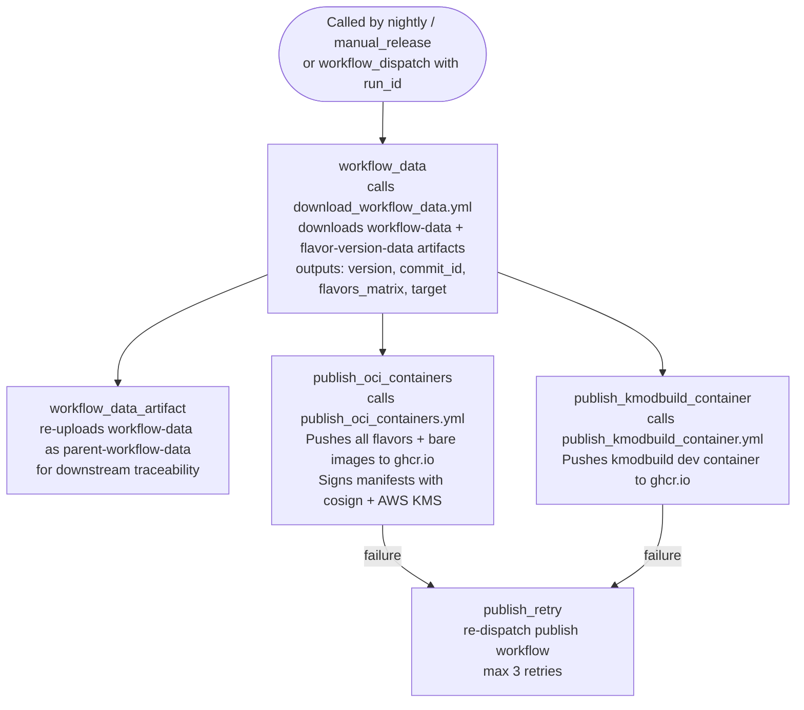
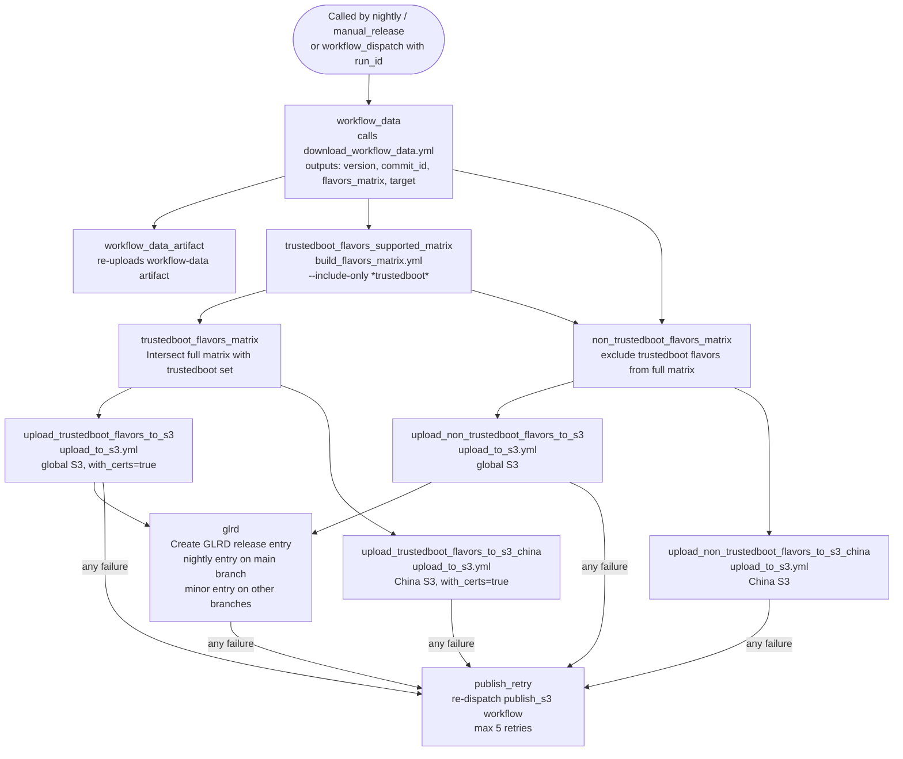

# GitHub Actions Workflows

Garden Linux uses GitHub Actions to build, test, and publish OS images. The workflow system is structured around a small set of **entry-point workflows** that orchestrate a larger set of **reusable (called) workflows**.

Two entry points drive the regular release cadence:

- **[`nightly.yml`](https://github.com/gardenlinux/gardenlinux/blob/main/.github/workflows/nightly.yml)** runs every day at 06:00 UTC on the `main` branch.
- **[`manual_release.yml`](https://github.com/gardenlinux/gardenlinux/blob/main/.github/workflows/manual_release.yml)** is triggered manually to build and publish a versioned (major.minor) release.

A third entry point, **[`manual_tests.yml`](https://github.com/gardenlinux/gardenlinux/blob/main/.github/workflows/manual_tests.yml)**, lets engineers run tests against an existing build or trigger a fresh build for testing only, without publishing.

All three entry points share the same reusable sub-workflows for building, testing, and publishing.

## Overview

The following diagram shows how the three entry-point workflows relate to the shared sub-workflows they call.

## [nightly.yml](https://github.com/gardenlinux/gardenlinux/blob/main/.github/workflows/nightly.yml)

**Trigger:** Cron schedule, daily at 06:00 UTC (runs on the `main` branch only).

**Purpose:** Builds every Garden Linux flavor, runs the full test suite, stores workflow metadata as artifacts, then publishes the resulting images to both the GitHub Container Registry (ghcr.io) and Amazon S3. The nightly build always uses `version: now` (today's date-based version) and `target: nightly`.

**Concurrency:** Only one nightly run is active at a time; in-progress runs are cancelled when a new schedule fires.

**Retry behaviour:** If the `build` job fails the workflow re-dispatches itself up to **5 times**. If the `test` job fails after a successful build the workflow re-dispatches itself up to **3 times**.

## [manual_release.yml](https://github.com/gardenlinux/gardenlinux/blob/main/.github/workflows/manual_release.yml)

**Trigger:** `workflow_dispatch` — a human (or automation) initiates the run from the GitHub Actions UI or API.

**Purpose:** Builds, tests, and (optionally) publishes a specific Garden Linux release. Accepts the following inputs:

| Input | Default | Description |
|---|---|---|
| `version` | *(required)* | Garden Linux version string, e.g. `2150.0.0` |
| `target` | *(required)* | `release` or `nightly` |
| `publish` | `true` | Whether to push artifacts after a successful test run |
| `test_types` | `chroot,qemu,cloud,oci,bare` | Comma-separated list of test environments to run |
| `flavors_parse_params_test` | `--exclude "bare-*" ...` | Arguments forwarded to `gl-flavors-parse` for the regular flavor matrix |
| `flavors_parse_params_test_bare` | `--include-only "bare-*" ...` | Arguments forwarded to `gl-flavors-parse` for the bare flavor matrix |
| `ignore_workflow_concurrency` | `false` | Allow concurrent runs of this workflow |

**Concurrency:** By default only one `manual_release` run per branch is active at a time. Set `ignore_workflow_concurrency: true` to allow parallel runs.

**Retry behaviour:** If the `build` job fails the workflow re-dispatches itself up to **3 times**. If the `test` job fails the workflow re-dispatches itself up to **5 times**.

**Key difference from [`nightly.yml`](https://github.com/gardenlinux/gardenlinux/blob/main/.github/workflows/nightly.yml):** The primary difference is the trigger mechanism — [`manual_release.yml`](https://github.com/gardenlinux/gardenlinux/blob/main/.github/workflows/manual_release.yml) is initiated on demand via `workflow_dispatch`, whereas [`nightly.yml`](https://github.com/gardenlinux/gardenlinux/blob/main/.github/workflows/nightly.yml) runs automatically on a daily schedule. This allows operators to (re)build and publish a specific version at any time. Additionally, the `publish_ghcr` and `publish_s3` jobs are guarded by `if: inputs.publish` (allowing build-and-test-only runs), and [`publish.yml`](https://github.com/gardenlinux/gardenlinux/blob/main/.github/workflows/publish.yml) / [`publish_s3.yml`](https://github.com/gardenlinux/gardenlinux/blob/main/.github/workflows/publish_s3.yml) are referenced at the pinned `@main` ref rather than the local repository ref.

## [manual_tests.yml](https://github.com/gardenlinux/gardenlinux/blob/main/.github/workflows/manual_tests.yml)

**Trigger:** `workflow_dispatch`.

**Purpose:** Allows engineers to run tests on demand. It supports two distinct modes:

- **Build mode** (`build: true`): Builds the specified version from source, then runs tests against the freshly built artifacts.
- **Download mode** (`build: false`, the default): Downloads pre-built artifacts from S3 (resolved via the Garden Linux Release Database — GLRD), then runs tests against those artifacts.

**Inputs:**

| Input | Default | Description |
|---|---|---|
| `version` | `now` | Garden Linux version to test |
| `target` | `dev` | `release`, `nightly`, or `dev` |
| `build` | `false` | Build from source instead of downloading artifacts |
| `test_types` | `chroot,qemu,cloud,oci` | Comma-separated list of test environments |
| `flavors_parse_params_test` | `--exclude "bare-*" ...` | Arguments for the regular flavor matrix |
| `flavors_parse_params_test_bare` | `--include-only "bare-*" ...` | Arguments for the bare flavor matrix (only relevant when `build=true`) |
| `ignore_workflow_concurrency` | `false` | Allow concurrent runs |

**Note:** Bare flavor tests (`bare` in `test_types`) only work when `build: true` because bare flavor OCI archives are not stored in S3.

## [tests.yml](https://github.com/gardenlinux/gardenlinux/blob/main/.github/workflows/tests.yml)

**Trigger:** `workflow_call` only — this workflow is never run directly. It is called by [`nightly.yml`](https://github.com/gardenlinux/gardenlinux/blob/main/.github/workflows/nightly.yml), [`manual_release.yml`](https://github.com/gardenlinux/gardenlinux/blob/main/.github/workflows/manual_release.yml), and [`manual_tests.yml`](https://github.com/gardenlinux/gardenlinux/blob/main/.github/workflows/manual_tests.yml).

**Purpose:** Runs the full (or partial) test suite for a set of flavors. The caller passes in a `flavors_matrix` (JSON) and a comma-separated list of `test_types`. The workflow:

1. Generates the set of flavors that each test environment supports (using [`build_flavors_matrix.yml`](https://github.com/gardenlinux/gardenlinux/blob/main/.github/workflows/build_flavors_matrix.yml)).
2. Intersects the caller-supplied matrix with the supported-flavors matrix so only meaningful test jobs are created.
3. Fans out to parallel per-flavor test jobs for each enabled test type.
4. Collects JUnit XML results and generates a workflow summary via [`test_report.yml`](https://github.com/gardenlinux/gardenlinux/blob/main/.github/workflows/test_report.yml).

**Inputs:**

| Input | Default | Description |
|---|---|---|
| `flavors_matrix` | *(required)* | JSON flavors matrix from the build step |
| `bare_flavors_matrix` | `{"include":[]}` | JSON matrix for bare flavors |
| `test_types` | `chroot,qemu,oci` | Comma-separated subset of `chroot`, `qemu`, `cloud`, `oci`, `bare` |

**Cloud test dependency:** Cloud tests only start after QEMU tests succeed (or QEMU tests are disabled). This ordering prevents unnecessary cloud resource consumption when a basic QEMU boot test already fails.

## [publish.yml](https://github.com/gardenlinux/gardenlinux/blob/main/.github/workflows/publish.yml)

**Trigger:** `workflow_call` (called by [`nightly.yml`](https://github.com/gardenlinux/gardenlinux/blob/main/.github/workflows/nightly.yml) and [`manual_release.yml`](https://github.com/gardenlinux/gardenlinux/blob/main/.github/workflows/manual_release.yml)) or `workflow_dispatch` (can be run standalone against an existing build run).

**Purpose:** Publishes built container images and the kernel-module build container to the GitHub Container Registry (ghcr.io). It reads the flavors matrix and version metadata from artifacts produced by the originating build run.

**Inputs:**

| Input | Description |
|---|---|
| `run_id` | The GitHub Actions run ID of the originating build workflow |
| `compatibility_flags` | Optional flags to activate compatibility modes (standalone `workflow_dispatch` only) |

**Retry behaviour:** If `publish_oci_containers` or `publish_kmodbuild_container` fails, a `publish_retry` job re-dispatches the workflow up to **3 times**.

## [publish_s3.yml](https://github.com/gardenlinux/gardenlinux/blob/main/.github/workflows/publish_s3.yml)

**Trigger:** `workflow_call` (called by [`nightly.yml`](https://github.com/gardenlinux/gardenlinux/blob/main/.github/workflows/nightly.yml) and [`manual_release.yml`](https://github.com/gardenlinux/gardenlinux/blob/main/.github/workflows/manual_release.yml)) or `workflow_dispatch` (can be run standalone).

**Purpose:** Uploads all built flavor artifacts to Amazon S3 buckets and registers the release in the Garden Linux Release Database (GLRD). Two separate S3 regions are supported: the global bucket and a China-region bucket.

**Flavors are split into two groups before upload:**

- **Trustedboot flavors** (name contains `trustedboot`): uploaded with `with_certs: true` so that Secure Boot certificates are included alongside the image.
- **Non-trustedboot flavors**: uploaded without certificates.

Both groups are uploaded to both the global and China S3 buckets in parallel.

**GLRD registration:**

- On the `main` branch: a `nightly` GLRD release entry is created.
- On any other branch: a `minor` GLRD release entry is created.

**Retry behaviour:** If any upload or GLRD job fails, a `publish_retry` job re-dispatches the workflow up to **5 times**.

## Shared sub-workflows

The following reusable workflows are called by the entry-point workflows and do not have independent triggers.

### Build sub-workflows

| Workflow | Purpose |
|---|---|
| [`build.yml`](https://github.com/gardenlinux/gardenlinux/blob/main/.github/workflows/build.yml) | Orchestrates the full build. Calls [`build_requirements.yml`](https://github.com/gardenlinux/gardenlinux/blob/main/.github/workflows/build_requirements.yml), [`build_flavors_matrix.yml`](https://github.com/gardenlinux/gardenlinux/blob/main/.github/workflows/build_flavors_matrix.yml), [`build_flavor.yml`](https://github.com/gardenlinux/gardenlinux/blob/main/.github/workflows/build_flavor.yml) (per flavor), [`build_bare_flavor.yml`](https://github.com/gardenlinux/gardenlinux/blob/main/.github/workflows/build_bare_flavor.yml) (per bare flavor), [`build_tests.yml`](https://github.com/gardenlinux/gardenlinux/blob/main/.github/workflows/build_tests.yml), and [`build_kmodbuild_container.yml`](https://github.com/gardenlinux/gardenlinux/blob/main/.github/workflows/build_kmodbuild_container.yml). Outputs `flavors_matrix`, `bare_flavors_matrix`, and `version`. |
| [`build_requirements.yml`](https://github.com/gardenlinux/gardenlinux/blob/main/.github/workflows/build_requirements.yml) | Calculates the build version string and commit ID (from the Git ref or GLRD). Determines the signing environment (dev/nightly/release). Provides Secure Boot certificates as a workflow artifact. |
| [`build_flavors_matrix.yml`](https://github.com/gardenlinux/gardenlinux/blob/main/.github/workflows/build_flavors_matrix.yml) | Calls `bin/gl-flavors-parse` with configurable flags to generate the JSON flavors matrix consumed by strategy matrix jobs. Can accept a pre-built matrix to skip parsing. |
| [`build_flavor.yml`](https://github.com/gardenlinux/gardenlinux/blob/main/.github/workflows/build_flavor.yml) | Builds a single Garden Linux flavor for a specific architecture. Authenticates to AWS KMS for Secure Boot signing when target is not `dev`. Uploads the build artifact as `build-{flavor}-{arch}`. |
| [`build_bare_flavor.yml`](https://github.com/gardenlinux/gardenlinux/blob/main/.github/workflows/build_bare_flavor.yml) | Builds a single bare (OCI-only) flavor. Uploads the resulting OCI archive as `build-{bare_flavor}-{arch}`. |
| [`build_tests.yml`](https://github.com/gardenlinux/gardenlinux/blob/main/.github/workflows/build_tests.yml) | Builds the test distribution (a tarball used by all test jobs) and builds test containers for `amd64` and `arm64`. Uploads as the `test-distribution` artifact. |
| [`build_kmodbuild_container.yml`](https://github.com/gardenlinux/gardenlinux/blob/main/.github/workflows/build_kmodbuild_container.yml) | Builds the kernel-module development container image. Uploads as `kmodbuild-container-{arch}`. |

### Test sub-workflows

| Workflow | Purpose |
|---|---|
| [`tests.yml`](https://github.com/gardenlinux/gardenlinux/blob/main/.github/workflows/tests.yml) | Orchestrates all testing. Calls [`build_flavors_matrix.yml`](https://github.com/gardenlinux/gardenlinux/blob/main/.github/workflows/build_flavors_matrix.yml) (five times to generate per-test-type supported-flavor matrices), then [`test_flavor_chroot.yml`](https://github.com/gardenlinux/gardenlinux/blob/main/.github/workflows/test_flavor_chroot.yml), [`test_flavor_qemu.yml`](https://github.com/gardenlinux/gardenlinux/blob/main/.github/workflows/test_flavor_qemu.yml), [`test_flavor_cloud.yml`](https://github.com/gardenlinux/gardenlinux/blob/main/.github/workflows/test_flavor_cloud.yml), and [`test_flavor_oci.yml`](https://github.com/gardenlinux/gardenlinux/blob/main/.github/workflows/test_flavor_oci.yml) (each per flavor via matrix strategy), and finally [`test_report.yml`](https://github.com/gardenlinux/gardenlinux/blob/main/.github/workflows/test_report.yml). Called by [`nightly.yml`](https://github.com/gardenlinux/gardenlinux/blob/main/.github/workflows/nightly.yml), [`manual_release.yml`](https://github.com/gardenlinux/gardenlinux/blob/main/.github/workflows/manual_release.yml), and [`manual_tests.yml`](https://github.com/gardenlinux/gardenlinux/blob/main/.github/workflows/manual_tests.yml). |
| [`test_flavor_chroot.yml`](https://github.com/gardenlinux/gardenlinux/blob/main/.github/workflows/test_flavor_chroot.yml) | Mounts the flavor rootfs in a chroot and runs the Garden Linux test suite inside it. Timeout: 10 minutes. |
| [`test_flavor_qemu.yml`](https://github.com/gardenlinux/gardenlinux/blob/main/.github/workflows/test_flavor_qemu.yml) | Boots the flavor image in QEMU and runs the test suite against the running VM. Supports raw, qcow2, vhd, vmdk, OVA, gcpimage, and PXE formats. Timeout: 40 minutes. |
| [`test_flavor_cloud.yml`](https://github.com/gardenlinux/gardenlinux/blob/main/.github/workflows/test_flavor_cloud.yml) | Deploys the flavor image to a real cloud platform (AWS, GCP, Azure, or Alibaba Cloud) using Terraform and runs the platform test suite. Uses the `oidc_platform_tests` GitHub environment for credential access. |
| [`test_flavor_oci.yml`](https://github.com/gardenlinux/gardenlinux/blob/main/.github/workflows/test_flavor_oci.yml) | Runs the test suite against the OCI container image. Timeout: 30 minutes. |
| [`test_report.yml`](https://github.com/gardenlinux/gardenlinux/blob/main/.github/workflows/test_report.yml) | Collects all `*-test-*.xml` JUnit artifacts and generates an annotated workflow summary using the `pytest-multi-results-action`. |

### Publish sub-workflows

| Workflow | Purpose |
|---|---|
| [`publish.yml`](https://github.com/gardenlinux/gardenlinux/blob/main/.github/workflows/publish.yml) | Orchestrates publishing to ghcr.io. Calls [`download_workflow_data.yml`](https://github.com/gardenlinux/gardenlinux/blob/main/.github/workflows/download_workflow_data.yml), then [`publish_oci_containers.yml`](https://github.com/gardenlinux/gardenlinux/blob/main/.github/workflows/publish_oci_containers.yml) and [`publish_kmodbuild_container.yml`](https://github.com/gardenlinux/gardenlinux/blob/main/.github/workflows/publish_kmodbuild_container.yml) in parallel. Can be triggered standalone via `workflow_dispatch` against an existing build run. |
| [`publish_s3.yml`](https://github.com/gardenlinux/gardenlinux/blob/main/.github/workflows/publish_s3.yml) | Orchestrates publishing to Amazon S3. Calls [`download_workflow_data.yml`](https://github.com/gardenlinux/gardenlinux/blob/main/.github/workflows/download_workflow_data.yml) and [`build_flavors_matrix.yml`](https://github.com/gardenlinux/gardenlinux/blob/main/.github/workflows/build_flavors_matrix.yml), then [`upload_to_s3.yml`](https://github.com/gardenlinux/gardenlinux/blob/main/.github/workflows/upload_to_s3.yml) (four times: trustedboot/non-trustedboot flavors, each to global and China S3 buckets), and registers a GLRD release entry. Can be triggered standalone via `workflow_dispatch`. |
| [`publish_oci_containers.yml`](https://github.com/gardenlinux/gardenlinux/blob/main/.github/workflows/publish_oci_containers.yml) | Publishes container base images (`container`, `container-pythonDev`), bare flavor images (libc, python, nodejs, sapmachine), and all regular flavor OCI images to ghcr.io. Signs each manifest with cosign using an AWS KMS key. Updates the OCI manifest index. |
| [`publish_kmodbuild_container.yml`](https://github.com/gardenlinux/gardenlinux/blob/main/.github/workflows/publish_kmodbuild_container.yml) | Loads and pushes the kmodbuild dev container to `ghcr.io/{org}/gardenlinux/kmodbuild:{version}`. |
| [`upload_to_s3.yml`](https://github.com/gardenlinux/gardenlinux/blob/main/.github/workflows/upload_to_s3.yml) | Uploads a set of flavor artifacts (selected by the flavors matrix) to an S3 bucket. Optionally includes Secure Boot certificates (`with_certs`). |
| [`download_workflow_data.yml`](https://github.com/gardenlinux/gardenlinux/blob/main/.github/workflows/download_workflow_data.yml) | Downloads and validates the `workflow-data` and `flavor-version-data` artifacts from the originating build run. Outputs `version`, `commit_id`, `flavors_matrix`, `bare_flavors_matrix`, `target`, and `original_workflow_name`. |
| [`download_flavors_images.yml`](https://github.com/gardenlinux/gardenlinux/blob/main/.github/workflows/download_flavors_images.yml) | Downloads pre-built flavor images from S3 for the given version and commit. Used by [`manual_tests.yml`](https://github.com/gardenlinux/gardenlinux/blob/main/.github/workflows/manual_tests.yml) in download mode. |

[`publish.yml`](https://github.com/gardenlinux/gardenlinux/blob/main/.github/workflows/publish.yml) and [`publish_s3.yml`](https://github.com/gardenlinux/gardenlinux/blob/main/.github/workflows/publish_s3.yml) are **independent and run in parallel**. Both are called by [`nightly.yml`](https://github.com/gardenlinux/gardenlinux/blob/main/.github/workflows/nightly.yml) and [`manual_release.yml`](https://github.com/gardenlinux/gardenlinux/blob/main/.github/workflows/manual_release.yml) after the build-test-upload_workflow_data sequence completes. [`publish.yml`](https://github.com/gardenlinux/gardenlinux/blob/main/.github/workflows/publish.yml) targets the GitHub Container Registry (ghcr.io) while [`publish_s3.yml`](https://github.com/gardenlinux/gardenlinux/blob/main/.github/workflows/publish_s3.yml) targets Amazon S3 and the GLRD. Neither depends on the other's success, and either can be re-triggered independently via `workflow_dispatch` using the `run_id` of a completed build.

## Retry mechanism

Several workflows implement an automatic retry mechanism to recover from transient failures in long-running CI jobs.

When a job that is marked as a retry candidate fails, a dedicated `*_retry` job runs immediately. The retry job calls `dispatchRetryWorkflow` from `.github/workflows/github.mjs`, which re-dispatches the parent workflow against the same Git ref. While the entire workflow is re-dispatched, GitHub only re-runs **failed** jobs — successful jobs from the previous run are reused (copied/linked internally by GitHub).

Each workflow has a configured maximum retry count:

| Workflow | Job | Max retries |
|---|---|---|
| [`nightly.yml`](https://github.com/gardenlinux/gardenlinux/blob/main/.github/workflows/nightly.yml) | `build_retry` | 5 |
| [`nightly.yml`](https://github.com/gardenlinux/gardenlinux/blob/main/.github/workflows/nightly.yml) | `test_retry` | 3 |
| [`manual_release.yml`](https://github.com/gardenlinux/gardenlinux/blob/main/.github/workflows/manual_release.yml) | `build_retry` | 3 |
| [`manual_release.yml`](https://github.com/gardenlinux/gardenlinux/blob/main/.github/workflows/manual_release.yml) | `test_retry` | 5 |
| [`publish.yml`](https://github.com/gardenlinux/gardenlinux/blob/main/.github/workflows/publish.yml) | `publish_retry` | 3 |
| [`publish_s3.yml`](https://github.com/gardenlinux/gardenlinux/blob/main/.github/workflows/publish_s3.yml) | `publish_retry` | 5 |

The retry count is decremented by the `dispatchRetryWorkflow` function on each re-dispatch. Once the counter reaches zero no further retries are attempted and the workflow run remains in a failed state.

## Artifact handoff between workflows

The build and publish phases communicate through GitHub Actions artifacts rather than direct job outputs. This decouples the build workflow from the publish workflow so that publishing can be re-triggered independently against an existing build.

The key artifacts and their producers/consumers are:

| Artifact name | Produced by | Consumed by |
|---|---|---|
| `build-{flavor}-{arch}` | [`build_flavor.yml`](https://github.com/gardenlinux/gardenlinux/blob/main/.github/workflows/build_flavor.yml) | `test_flavor_*.yml`, [`publish_oci_containers.yml`](https://github.com/gardenlinux/gardenlinux/blob/main/.github/workflows/publish_oci_containers.yml), [`upload_to_s3.yml`](https://github.com/gardenlinux/gardenlinux/blob/main/.github/workflows/upload_to_s3.yml) |
| `build-bare-{flavor}-{arch}` | [`build_bare_flavor.yml`](https://github.com/gardenlinux/gardenlinux/blob/main/.github/workflows/build_bare_flavor.yml) | [`publish_oci_containers.yml`](https://github.com/gardenlinux/gardenlinux/blob/main/.github/workflows/publish_oci_containers.yml) (bare_flavors) |
| `certs` | [`build_requirements.yml`](https://github.com/gardenlinux/gardenlinux/blob/main/.github/workflows/build_requirements.yml) | [`build_flavor.yml`](https://github.com/gardenlinux/gardenlinux/blob/main/.github/workflows/build_flavor.yml), [`test_flavor_qemu.yml`](https://github.com/gardenlinux/gardenlinux/blob/main/.github/workflows/test_flavor_qemu.yml), [`test_flavor_cloud.yml`](https://github.com/gardenlinux/gardenlinux/blob/main/.github/workflows/test_flavor_cloud.yml) |
| `test-distribution` | [`build_tests.yml`](https://github.com/gardenlinux/gardenlinux/blob/main/.github/workflows/build_tests.yml) | [`test_flavor_chroot.yml`](https://github.com/gardenlinux/gardenlinux/blob/main/.github/workflows/test_flavor_chroot.yml), [`test_flavor_qemu.yml`](https://github.com/gardenlinux/gardenlinux/blob/main/.github/workflows/test_flavor_qemu.yml), [`test_flavor_cloud.yml`](https://github.com/gardenlinux/gardenlinux/blob/main/.github/workflows/test_flavor_cloud.yml), [`test_flavor_oci.yml`](https://github.com/gardenlinux/gardenlinux/blob/main/.github/workflows/test_flavor_oci.yml) |
| `kmodbuild-container-{arch}` | [`build_kmodbuild_container.yml`](https://github.com/gardenlinux/gardenlinux/blob/main/.github/workflows/build_kmodbuild_container.yml) | [`publish_kmodbuild_container.yml`](https://github.com/gardenlinux/gardenlinux/blob/main/.github/workflows/publish_kmodbuild_container.yml) |
| `workflow-data` | [`nightly.yml`](https://github.com/gardenlinux/gardenlinux/blob/main/.github/workflows/nightly.yml) / [`manual_release.yml`](https://github.com/gardenlinux/gardenlinux/blob/main/.github/workflows/manual_release.yml) (upload_workflow_data job) | [`download_workflow_data.yml`](https://github.com/gardenlinux/gardenlinux/blob/main/.github/workflows/download_workflow_data.yml) |
| `flavor-version-data` | [`build.yml`](https://github.com/gardenlinux/gardenlinux/blob/main/.github/workflows/build.yml) (upload_flavor_version_data job) | [`download_workflow_data.yml`](https://github.com/gardenlinux/gardenlinux/blob/main/.github/workflows/download_workflow_data.yml), [`test_report.yml`](https://github.com/gardenlinux/gardenlinux/blob/main/.github/workflows/test_report.yml) |
| `{chroot,qemu,cloud,oci}-test-{cname}` | `test_flavor_*.yml` | [`test_report.yml`](https://github.com/gardenlinux/gardenlinux/blob/main/.github/workflows/test_report.yml) |

## Related topics

<RelatedTopics />
