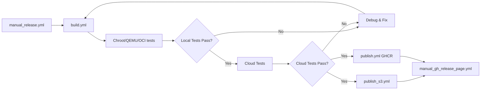
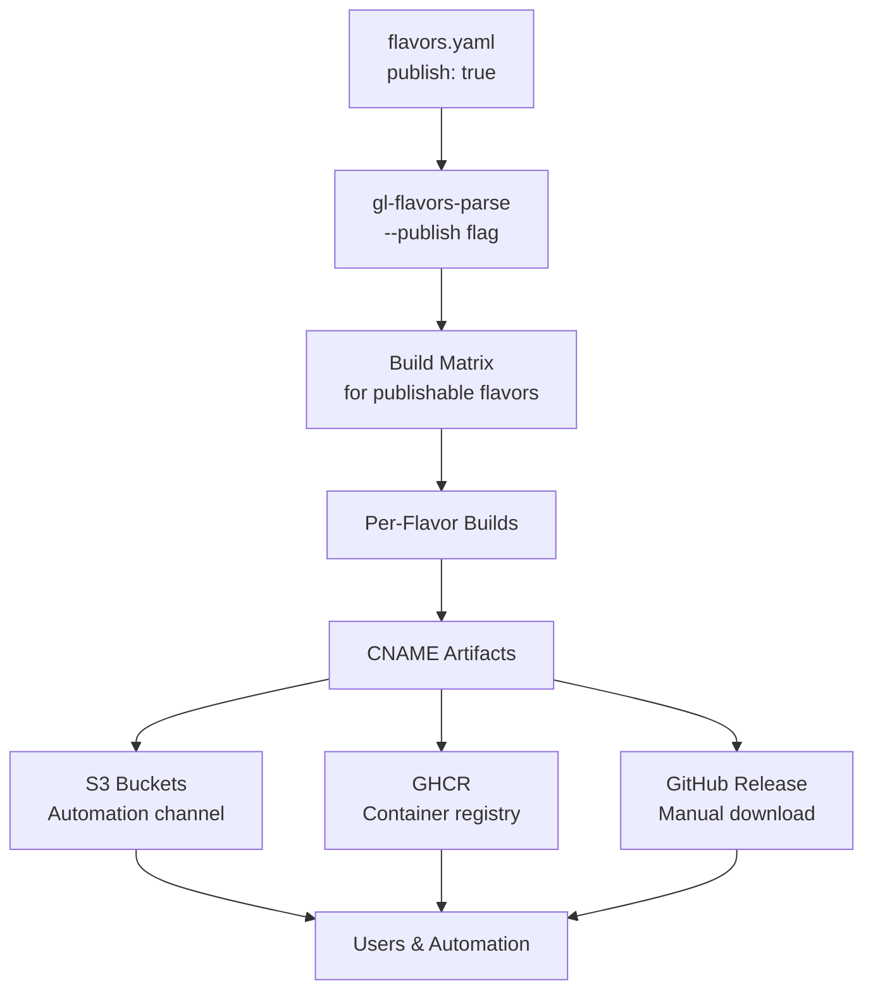

# OS Releases

OS releases are deployable operating system images distributed to end users.

Unlike traditional distributions that release a single image file, Garden Linux OS releases generate a diverse ecosystem of artifacts, each serving specific purposes across different deployment scenarios. These artifacts flow through multiple distribution channels and are accompanied by extensive metadata that ensures security, verifiability, and compliance.

## Release hierarchy

Garden Linux uses a [three-tier release hierarchy](/explanation/release-hierarchy.md) to deliver a complete operating system.

This document is about the third tier, the [OS Releases](/explanation/os-releases) - where abstract package definitions become concrete, deployable operating system images distributed to end users.

## Versioning and release types

Garden Linux uses a semantic versioning scheme `MAJOR.MINOR.PATCH`. For complete details about versioning, see the [Semantic Versioning](/explanation/semver.md) document.

OS releases follow a structured lifecycle with distinct phases:

1. **Major releases** (`2150.0.0`) - New Debian snapshots with feature updates
2. **Minor releases** (`2150.1.0`) - Security patches and CVE fixes within a major version
3. **Nightly releases** - Continuous integration builds from main branch

Each release type serves different user needs, with major releases initiating a new support cycle and minor releases extending security coverage. For complete information about maintenance phases and support commitments, see the [Release Lifecycle](/reference/releases/release-lifecycle.md) document.

## Core artifacts

### OS image formats

Garden Linux generates platform-specific image formats optimized for each deployment environment:

| Platform   | Image Format      | Purpose                              |
| ---------- | ----------------- | ------------------------------------ |
| AWS        | `.raw`            | Amazon Machine Image (AMI) format    |
| Azure      | `.vhd`            | Virtual Hard Disk for Azure          |
| GCP        | `gcpimage.tar.gz` | Google Compute Engine import         |
| KVM        | `.qcow2`          | QEMU copy-on-write format            |
| Bare Metal | `.raw`            | Compressed raw disk for direct write |
| OpenStack  | `.raw`, `.qcow2`  | OpenStack Glance compatible          |

These specialized formats ensure optimal performance and integration with each platform's virtualization or provisioning systems.

### The CNAME system

Every artifact receives a canonical name (CNAME) that serves as its unique identifier throughout the pipeline. The CNAME format encodes all essential information:

```
{target}-{features}-{arch}-{version}-{commit}
```

For example:

```
aws-gardener_prod-amd64-2150.0.0-31a9f915
```

The CNAME is generated using `gl-features-parse --cname` and serves critical functions:

- **Uniqueness**: No two artifacts can have the same name
- **Traceability**: The name contains target, features, architecture, version, and source commit
- **Automation**: CI/CD systems can programmatically identify and retrieve specific variants
- **Distribution**: S3 paths and container tags are derived from the CNAME

This system ensures that what was built, tested, and deployed can be precisely identified and reproduced.

## Distribution channels

### S3: Primary automation channel

An Amazon S3 bucket serves as the primary distribution channel for OS images, providing:

- Direct access for automation and CI/CD pipelines
- High availability and durability
- Regional distribution (global and China-specific buckets)

Artifact organization follows the CNAME hierarchy:

```
s3://gardenlinux-images/
  └── {cname}/
      └── {version}/
          ├── {cname}.tar.gz
          ├── {cname}.vhd
          └── {cname}.raw.xz
```

For example, the AWS Gardener image for version 2150.0.0 appears at:

```
s3://gardenlinux-images/aws-gardener_prod-amd64-2150.0.0/2150.0.0/aws-gardener_prod-amd64-2150.0.0.tar.gz
```

### GitHub Actions artifacts

In the publishing phase, artifacts are uploaded as Assets to the official Github Releases.

Artifacts follow the naming pattern `build-{flavor}-{arch}` and can be downloaded from the [Github Releases Page](https://github.com/gardenlinux/gardenlinux/releases).

### GHCR: Container distribution

For containerized workloads, Garden Linux publishes OCI-compliant container images to the [GitHub Container Registry (GHCR)](https://github.com/gardenlinux/gardenlinux/pkgs/container/gardenlinux):

```
[ghcr.io/gardenlinux/gardenlinux:{version}
```

The tagging strategy serves different use cases:

| Tag        | Purpose                    |
| ---------- | -------------------------- |
| `2150.0.0` | Specific release           |
| `latest`   | Most recent stable release |

Container images use OCI manifest lists to support multiple architectures (amd64, arm64).

## Release metadata

Beyond deployable artifacts, OS releases generate essential metadata for security, compliance, and operational awareness.

### GitHub release notes

Automatically generated release notes provide complete information about each release:

- Software Component Versions
- Published Images

The [`manual_gh_release_page.yml`](https://github.com/gardenlinux/gardenlinux/blob/main/.github/workflows/manual_gh_release_page.yml) workflow orchestrates this process by:

1. Creating a GLRD (Garden Linux Release Database) entry
2. Triggering GLVD (Garden Linux Vulnerability Database) ingestion
3. Generating the release page with aggregated information
4. Attaching appropriate artifacts
5. Tagging container images as `latest` when appropriate

### CPE files for vulnerability tracking

Common Platform Enumeration (CPE) files enable automated vulnerability scanning tools to identify affected systems. Generated via the `cpe.yml` workflow, these files:

- Document all packages in the release with their versions
- Enable accurate CVE correlation
- Integrate with enterprise security platforms
- Are published to S3 and attached to GitHub releases

## The publication pipeline

### Selective flavor publication

Only flavors explicitly marked with `publish: true` in `flavors.yaml` are included in releases.

The [flavor system](/explanation/flavors.md) determines which variants proceed to publication based on their maturity and support requirements.

### GitHub workflows orchestration

The release process is orchestrated through an interconnected workflow system:



Key workflows in the pipeline:

- **`manual_release.yml`**: The orchestrator that manages the complete build-test-publish sequence
- **`build.yml`**: Generates the flavor build matrix and executes per-flavor builds
- **`tests.yml`**: Runs multi-platform validation across chroot, qemu, cloud, and oci environments
- **`publish_s3.yml`**: Uploads OS images to S3 buckets organized by CNAME and version
- **`publish.yml`**: Pushes container images to GHCR with multi-arch manifest creation
- **`manual_gh_release_page.yml`**: Creates the GitHub release with notes, metadata, and attached artifacts

The pipeline ensures that only successfully tested artifacts reach distribution channels.

For a detailed explanation of all CI/CD workflows and their interactions, see [GitHub Actions Workflows](/explanation/github-workflows.md).

## Artifact flow

All release artifacts trace their lineage to the flavor configuration:



This flow ensures consistency between what is defined, built, tested, and distributed.

## Related topics

<RelatedTopics />
