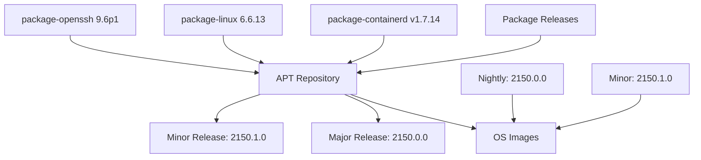

# Release Hierarchy

Garden Linux uses a three-tier release hierarchy to deliver a complete operating system:

## 1. Package releases

Individual software packages are built and versioned in `package-*` repositories (e.g., `package-containerd`, `package-curl`). Each package has its own releases cycle and versioning. Release cycles might even differ between Garden Linux Major OS Releases.

**Types**:

- **`main` branch**: Might be updated automatically if upstream sources change.
- **`rel-*` branches**: Updated manually for new Garden Linux Major OS Releases.

**Managed by**: Individual [`package-*` repositories](https://github.com/gardenlinux/?q=package-*)

**Documentation**:

- **Explanation**: [Garden Linux Packaging](/explanation/packaging) - This document explains how Garden Linux packages are built using the tools in the `package-build` repository and how they fit into the broader packaging ecosystem.
- **How-To**: [Packaging](/how-to/packaging/) - Overview how to use the Garden Linux Package Build System

## 2. APT repository releases

Collections of packages assembled into APT repositories. These repositories contain both custom-built packages and dependencies from Debian snapshots.

**Types**:

- **Nightly releases**: Automatically generated daily (e.g., `2150.0.0`)
- **Minor releases**: Manually created for specific updates (e.g., `2150.1.0`, `2150.2.0`)

**Managed by**: [`gardenlinux/repo`](https://github.com/gardenlinux/repo) repository

**Documentation**:

- **Explanation**: [Garden Linux Repository Infrastructure ](/explanation/repo-infrastructure.html) - Understand how Garden Linux assembles, distributes, and releases packages through its repository infrastructure
- **How-To**: [Creating APT Repository Releases](/how-to/releases/apt-repos.html) - Comprehensive guide to creating releases for Garden Linux APT repositories

## 3. Operating system image releases

Complete Garden Linux operating system images built by consuming an APT repository. These are the final artifacts that users deploy.

**Types**:

- **[Major/Stable releases](/reference/releases/release-lifecycle.html#stable-releases)**: New versions based on new Debian snapshots (e.g., `2150.0.0`)
- **[Minor releases](/reference/releases/release-lifecycle.html#minor-releases)**: Updates to existing major versions (e.g., `2150.1.0`)

**Managed by**: [`gardenlinux/gardenlinux`](https://github.com/gardenlinux/gardenlinux) repository

**Documentation**:

- **Explanation**: [OS Releases](/explanation/os-releases.md) - Understand what Garden Linux OS Releases are
- **How-To**: [Creating OS Releases ](/how-to/releases/os-releases.md) - Comprehensive guide to creating Garden Linux OS major and minor releases

## Release flow diagram

## Related topics

<RelatedTopics />
