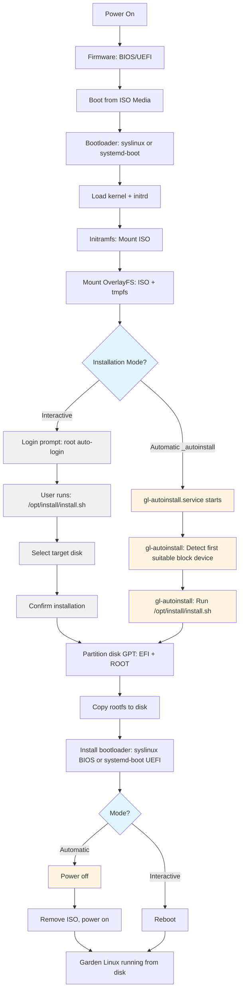

# Install Using ISO

Boot Garden Linux from ISO media (USB drive, CD-ROM, or virtual CD-ROM for VMs) and install to disk. Two installation modes are available: interactive manual installation (using the [`_iso`](/reference/features/_iso) feature which includes [`_install`](/reference/features/_install)) and automatic unattended installation (using the [`_autoinstall`](/reference/features/_autoinstall) feature).

## Prerequisites

- **Garden Linux ISO** — [Image built](/how-to/building-images.md) with [`_iso`](/reference/features/_iso) feature (which includes [`_install`](/reference/features/_install)) or [`_autoinstall`](/reference/features/_autoinstall) for automatic installation
- **Target system** — Physical server or virtual machine with BIOS or UEFI firmware
- **Boot media** — USB drive (for physical hardware) or virtual CD-ROM (for VM testing)
- **Target disk** — At least one writable block device for installation (separate from the ISO media)

## Overview

The ISO installation process boots Garden Linux as a live system from removable media, installs the system to a target disk, and reboots into the installed system. The workflow consists of:

1. **Boot from ISO** — Firmware loads the bootloader from ISO media (UEFI: systemd-boot; Legacy BIOS: syslinux)
2. **Live system** — Garden Linux runs from the ISO root filesystem with an OverlayFS tmpfs layer
3. **Installation** — Either runs automatically ([`_autoinstall`](/reference/features/_autoinstall) feature) or is triggered manually by running [`/opt/install/install.sh`](https://github.com/gardenlinux/gardenlinux/blob/main/features/_install/file.include/opt/install/install.sh) (provided by [`_install`](/reference/features/_install) feature, included in [`_iso`](/reference/features/_iso))
4. **Disk install** — Partitions the target disk, copies the root filesystem to disk, and installs the bootloader
5. **Reboot** — System reboots into the installed system from disk

### Boot and Installation Flow




## Disk Layout and Bootloader

The installation creates a GPT partition table with EFI (510 MiB, FAT32) and ROOT (remaining space, ext4) partitions. The bootloader is firmware-dependent: syslinux for Legacy BIOS, systemd-boot for UEFI.

For full details on the partition layout and bootloader configuration, see [Disk Layout and Bootloader](/how-to/installation/on-premises/disk-layout.md).

## Prepare the ISO

Before installing, build the appropriate Garden Linux ISO for your use case and write it to boot media.

### Build an Interactive ISO

Build a Garden Linux ISO with the [`_iso`](/reference/features/_iso) feature for interactive (manual) installation:

```bash
./build baremetal-gardener_prod_iso
```

This generates an ISO image in `.build/` with the naming pattern `baremetal-gardener_prod_iso-amd64-<version>-<commit>.iso`.

### Build an Auto-Install ISO

Build a Garden Linux ISO with the [`_autoinstall`](/reference/features/_autoinstall) feature for automatic unattended installation (includes `_iso`):

```bash
./build baremetal-gardener_prod_autoinstall
```

This generates an ISO image in `.build/` with the naming pattern `baremetal-gardener_prod_autoinstall-amd64-<version>-<commit>.iso`.

:::info
See the how-to guide on [building images](/how-to/building-images.md) for detailed build system documentation.
:::

### Write ISO to Boot Media

For physical hardware installation, write the ISO to a USB drive:

```bash
# Identify the USB drive
lsblk

# Write ISO to USB drive (replace /dev/sdX with your USB device)
sudo dd if=.build/<iso-filename>.iso of=/dev/sdX bs=4M status=progress
sync
```

For virtual machines, attach the ISO file directly as a virtual CD-ROM — no media preparation is needed.

## Interactive Installation

Interactive installation provides manual control over the target disk selection and installation process. Use this method when you need to verify the target disk or perform custom disk management.

### Boot from ISO

1. **Physical hardware** — Insert the USB drive and configure the BIOS/UEFI to boot from USB
2. **Virtual machine** — Attach the ISO as a virtual CD-ROM and configure the VM to boot from CD

The system boots into a live Garden Linux environment with root auto-login on the console.

### Run the Installer

Log in as root (auto-login on console) and run the installation script:

```bash
/opt/install/install.sh
```

The installer prompts for the target disk:

```
Available block devices:
  /dev/sda (20 GiB)
  /dev/sdb (100 GiB)

Enter target disk (e.g., /dev/sda): /dev/sdb
```

After disk selection, the installer displays a confirmation prompt:

```
WARNING: This will erase ALL data on /dev/sdb
Continue? (yes/no): yes
```

The installation process:

1. Creates a GPT partition table with EFI and ROOT partitions
2. Formats partitions (FAT32 for EFI, ext4 for ROOT)
3. Copies the live system's root filesystem to the ROOT partition
4. Installs the bootloader (syslinux for BIOS, systemd-boot for UEFI)
5. Prompts for reboot

After installation completes, remove the ISO media and reboot:

```bash
reboot
```

The system boots into the installed Garden Linux from disk.

## Automatic Installation (Auto-Install ISO)

Automatic installation eliminates manual interaction by detecting the first suitable block device and installing automatically on first boot. Use this method for automated deployments, VM provisioning, or testing scenarios.

### How Auto-Install Works

When the ISO boots:

1. The `gl-autoinstall.service` systemd unit starts after the system reaches `default.target`
2. The `/usr/local/sbin/gl-autoinstall` script runs and detects the first suitable block device:
   - Skips loop devices (`loop*`)
   - Skips CD-ROM devices (`sr*`)
   - Skips RAM disks (`ram*`, `zram*`)
   - Skips read-only devices
   - Skips removable devices (USB drives, CD-ROMs)
3. Sets `GL_INSTALL_TARGET` to the detected device and runs `/opt/install/install.sh` non-interactively
4. After successful installation, powers off the system

The first non-removable writable block device is selected as the installation target. For typical single-disk systems, this is `/dev/sda` or `/dev/vda` (virtio disk in VMs).

### Override the Target Disk

To specify a different target disk, pass the `gl.install.target=` kernel parameter. Edit the bootloader configuration at ISO boot time:

**UEFI (systemd-boot)**:
1. At the boot menu, press `e` to edit the boot entry
2. Append `gl.install.target=/dev/nvme0n1` to the kernel command line
3. Press Enter to boot

**Legacy BIOS (syslinux)**:
1. At the boot menu, press Tab to edit the boot command
2. Append `gl.install.target=/dev/nvme0n1` to the command line
3. Press Enter to boot

The `gl-autoinstall` script will use the specified device instead of auto-detecting.

### Post-Installation Workflow

After installation completes and the system powers off:

1. Remove the ISO media (eject CD-ROM, unmount virtual CD, or remove USB drive)
2. Power on the system
3. The system boots from the installed disk

This workflow enables automated unattended installation in batch provisioning scenarios.

## Post-Installation

After installation, the system boots directly from disk. The live boot dracut module is automatically disabled during installation.

To configure the installed system:

- **Enable SSH** — SSH is disabled by default. Enable manually after installation:
  ```bash
  systemctl enable --now ssh.service
  ```
- **Create users** — The default ISO includes only the root user. Create users after installation or use `chroot` from a live system as described in [Post-Install Configuration](/how-to/installation/post-install.md)
- **Configure networking** — Network configuration can be managed using systemd-networkd or NetworkManager depending on the flavor
- **Provision with Ignition or cloud-init** — For automated system configuration, see [Provision with Ignition](/how-to/installation/ignition.md) (bare-metal/PXE) or [Provision with cloud-init](/how-to/installation/cloud-init.md) (cloud platforms)

For more post-installation configuration options, see the [Post-Install Configuration](/how-to/installation/post-install.md) guide.

## Troubleshooting

### System Does Not Boot from ISO

- **Verify boot order** — Ensure CD-ROM or USB is set as the first boot device in BIOS/UEFI settings
- **Check ISO integrity** — Verify the ISO file checksum matches the expected value
- **Try different USB write method** — If using USB, try writing with different tools (`dd`, Rufus, Etcher)

### Installer Does Not Detect Target Disk

- **Verify disk is visible** — Check that the target disk appears in `lsblk` output before running the installer
- **Check disk is writable** — Ensure the disk is not read-only (check `ro` flag in `/sys/block/*/ro`)
- **Ensure disk is separate from ISO** — The installer skips removable media to avoid installing over the ISO media itself

### Installation Fails or Errors

- **Check disk space** — Ensure the target disk has at least 5 GiB of available space
- **Verify filesystem support** — The installer requires ext4 and FAT32 filesystem support
- **Review installation logs** — After a failed installation, check journal logs:
  ```bash
  journalctl -u install.service
  journalctl -u gl-autoinstall.service  # For auto-install ISOs
  ```

### Auto-Install Does Not Start

- **Verify [`_autoinstall`](/reference/features/_autoinstall) feature is present** — Check that the ISO was built with the [`_autoinstall`](/reference/features/_autoinstall) feature
- **Check for suitable disks** — Ensure at least one non-removable writable block device exists
- **Review service logs** — Boot the ISO and check:
  ```bash
  systemctl status gl-autoinstall.service
  journalctl -u gl-autoinstall.service
  ```

### System Boots Back to ISO After Installation

- **Remove ISO media** — Ensure the ISO media (USB drive or virtual CD-ROM) is removed or unmounted before rebooting
- **Check boot order** — Configure BIOS/UEFI to prioritize the installed disk over removable media
- **Verify bootloader installation** — Check installation logs for bootloader installation errors

## Testing ISO Installation in QEMU

The Garden Linux test framework includes built-in support for testing ISO installations using QEMU. For ISO images with the [`_autoinstall`](/reference/features/_autoinstall) feature, the test framework automatically detects this capability (via the `.requirements` file) and triggers a two-stage process:

1. **Stage 1** — Boot from ISO, install to disk automatically (via `gl-autoinstall.service`), kexec into installed system
2. **Stage 2** — Run tests on the installed system

### Run Installation Tests

Test an ISO installation with:

```bash
./test .build/baremetal-gardener_prod_autoinstall-amd64-*.iso
```

The test script automatically:

1. Detects that the ISO has the [`_autoinstall`](/reference/features/_autoinstall) feature by reading the `.requirements` file
2. Creates a virtual disk (`/dev/vda` in QEMU)
3. Boots the ISO — the `gl-autoinstall.service` runs automatically and installs to `/dev/vda`
4. Waits for installation to complete and kexec into the installed system
5. Runs the test suite on the installed system

## Reference

- [syslinux Documentation](https://wiki.syslinux.org/)
- [systemd-boot Documentation](https://www.freedesktop.org/software/systemd/man/latest/systemd-boot.html)
- [Boot Loader Specification](https://systemd.io/BOOT_LOADER_SPECIFICATION/)
- [QEMU Documentation](https://www.qemu.org/documentation/)

## Related Topics

<RelatedTopics />
