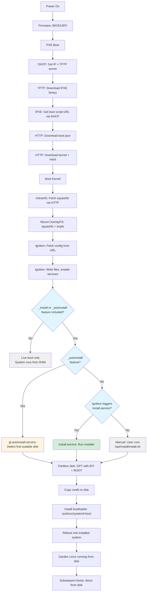

# Install Using PXE Boot

Deploy Garden Linux on bare-metal systems using iPXE network boot. This guide covers two PXE deployment modes: ephemeral live boot (system runs from RAM) and persistent boot+install (system installs to disk).

For non-network installations using bootable media, see [Install Using ISO](/how-to/installation/on-premises/iso.md).

## Overview

Garden Linux supports two PXE deployment modes:

1. **PXE Live Boot** — Boot Garden Linux from the network and run entirely from RAM. The system is ephemeral and stateless; changes are lost on reboot.

2. **PXE Boot + Install** — Boot from the network, then automatically install to disk for persistent storage. First boot runs from RAM while installing to disk, then reboots into the installed system. Subsequent boots load directly from disk.

Both modes support [Ignition](/how-to/installation/ignition) for first-boot configuration (users, SSH keys, files, services).

### PXE Live Boot Workflow

1. **Network boot via iPXE** — Client firmware loads iPXE from TFTP, which fetches the kernel, initrd, and squashfs root filesystem over HTTP
2. **Live system** — Garden Linux runs from an OverlayFS with the squashfs image as the lower layer and tmpfs as the upper layer
3. **Ignition configuration** (optional) — Applies first-boot configuration if configured
4. **System ready** — Garden Linux runs from RAM; changes are ephemeral

### PXE Boot + Install Workflow

1. **Network boot via iPXE** — Same as live boot: fetch kernel, initrd, and squashfs over HTTP
2. **Live system** — Garden Linux runs from OverlayFS temporarily
3. **Ignition configuration** — Applies partition layout, target disk configuration, and merges the install configuration
4. **Installation** — Copies the live system to disk, installs the bootloader, and reboots into the installed system
5. **Subsequent boots** — System boots directly from disk without PXE

### Boot + Install Flow Diagram



## Prerequisites

- **Target clients** — Physical servers or virtual machines with BIOS or UEFI firmware supporting network boot
- **Garden Linux build** — Image built with [`_pxe`](/reference/features/_pxe) (which includes [`_ignite`](/reference/features/_ignite) for Ignition support), [`baremetal`](/reference/features/baremetal), and [`server`](/reference/features/server) features, generating:
  - `vmlinuz` — Kernel image
  - `initrd` — Initramfs with live boot support
  - `root.squashfs` — Compressed root filesystem
  - For disk installation, also include [`_install`](/reference/features/_install) or [`_autoinstall`](/reference/features/_autoinstall)
- **TFTP server** — Serves iPXE binaries for Legacy BIOS and UEFI firmware:
  - `undionly.kpxe` — Legacy BIOS iPXE binary
  - `ipxe.efi` — UEFI iPXE binary
- **DHCP server** — Provides IP addresses and PXE chainloading configuration
- **HTTP server** — Hosts Garden Linux images, iPXE boot scripts, and Ignition configuration files

Download iPXE binaries from <https://boot.ipxe.org>.

## Disk Layout and Bootloader

The installation creates a GPT partition table with EFI (510 MiB, VFAT) and ROOT (remaining space, ext4) partitions. The bootloader is firmware-dependent: syslinux for Legacy BIOS, systemd-boot for UEFI.

For full details on the partition layout and bootloader configuration, see [Disk Layout and Bootloader](/how-to/installation/on-premises/disk-layout.md).

## Prepare PXE Boot Artifacts

Before deploying, build Garden Linux with PXE support and create the iPXE boot script.

### Build PXE Images

Build a Garden Linux image with the [`_pxe`](/reference/features/_pxe) feature:

```bash
./build baremetal-gardener_prod_pxe
```

This generates an archive in `.build/` with the naming pattern `baremetal-gardener_prod_pxe-amd64-<version>-<commit>.pxe.tar.gz`. This archive needs to be extracted and contains the following files:
- `vmlinuz` — Kernel image
- `initrd` — Initramfs with live boot and Ignition support
- `root.squashfs` — Compressed root filesystem
- `cmdline` — Kernel Command-Line for live boot

```bash
tar -C .build -xf baremetal-gardener_prod_pxe-amd64-today-local.pxe.tar.gz
```

### Build Variants for PXE

The [`_pxe`](/reference/features/_pxe) feature provides the core PXE boot capability (network boot with Ignition support). For disk installation, add either [`_install`](/reference/features/_install) (manual/Ignition-triggered) or [`_autoinstall`](/reference/features/_autoinstall) (automatic):

| Build Command | Features | Use Case |
|---------------|----------|----------|
| `./build baremetal-gardener_prod_pxe` | [`_pxe`](/reference/features/_pxe) | Live boot only (ephemeral, runs from RAM) |
| `./build baremetal-gardener_prod_pxe_install` | [`_pxe`](/reference/features/_pxe), [`_install`](/reference/features/_install) | Manual or Ignition-triggered installation |
| `./build baremetal-gardener_prod_pxe_autoinstall` | [`_pxe`](/reference/features/_pxe), [`_autoinstall`](/reference/features/_autoinstall) | Automatic installation to first disk |

The [`_autoinstall`](/reference/features/_autoinstall) feature includes [`_install`](/reference/features/_install), so you get both automatic detection and the ability to manually run the installer.

::: tip Building PXE Images
For detailed build system documentation and building PXE images with custom features, see [Building Images](/how-to/building-images.md).
:::

### Create the iPXE Boot Script

Create an iPXE boot script that instructs iPXE to fetch the Garden Linux kernel, initramfs, and root filesystem. The kernel parameters differ depending on the deployment mode.

#### Live Boot Only (No Disk Installation)

For an ephemeral live boot without installing to disk:

```bash
cat > boot.ipxe <<'EOF'
#!ipxe

set base-url http://192.168.1.10:8080
kernel ${base-url}/vmlinuz initrd=rootfs.initrd \
  gl.ovl=/:tmpfs \
  gl.url=${base-url}/root.squashfs \
  gl.live=1 \
  ip=dhcp \
  console=ttyS0,115200n8 console=tty0
initrd ${base-url}/initrd
boot

EOF
```

This boots Garden Linux from RAM without Ignition configuration. To add Ignition support for configuring users, SSH keys, or services while in live mode, add these kernel parameters:

```bash
ignition.firstboot=1 \
ignition.config.url=${base-url}/ignition.json \
ignition.platform.id=metal
```

#### Boot + Install to Disk

:::warning Required Feature
Boot + install mode requires the [`_install`](/reference/features/_install) or [`_autoinstall`](/reference/features/_autoinstall) feature. If your PXE image was built without these features, the `/opt/install/install.sh` script will not be available.
:::

For persistent installation to disk:

```bash
cat > boot.ipxe <<'EOF'
#!ipxe

set base-url http://192.168.1.10:8080
kernel ${base-url}/vmlinuz initrd=rootfs.initrd \
  gl.ovl=/:tmpfs \
  gl.url=${base-url}/root.squashfs \
  gl.live=1 \
  ip=dhcp \
  console=ttyS1,115200n8 console=tty0 \
  earlyprintk=ttyS1,115200n8 consoleblank=0 \
  ignition.firstboot=1 \
  ignition.config.url=${base-url}/ignition.json \
  ignition.platform.id=metal
initrd ${base-url}/initrd
boot

EOF
```

This requires an Ignition configuration that triggers the built-in `/opt/install/install.sh` script. See [Configure First-Boot Provisioning](#configure-first-boot-provisioning).

:::tip
The `cmdline` file from the `*.pxe.tar.gz` archive contains many useful parameters and can be used as a reference when building custom boot scripts.
:::

### Kernel Parameters Explained

| Parameter | Live Boot | Boot + Install | Description |
|-----------|-----------|----------------|-------------|
| `gl.ovl=/:tmpfs` | Required | Required | Use tmpfs as the upper layer for the OverlayFS root filesystem |
| `gl.url=<url>` | Required | Required | URL to the compressed root filesystem image (`root.squashfs`) |
| `gl.live=1` | Required | Required | Enable live boot mode (system runs from OverlayFS during initial boot) |
| `ip=dhcp` | Required | Required | Configure network interfaces via DHCP |
| `console=ttyS0` / `ttyS1` | Recommended | Recommended | Output to serial console (use `ttyS0` for live boot, `ttyS1` for install) |
| `console=tty0` | Recommended | Recommended | Output to VGA console |
| `ignition.firstboot=1` | Optional | Required | Tell Ignition this is a first boot (Ignition only runs on first boot) |
| `ignition.config.url=<url>` | Optional | Required | URL to the Ignition configuration file (`.json` format) |
| `ignition.platform.id=metal` | Optional | Required | Platform identifier for Ignition (use `metal` for bare-metal deployments) |

Replace `http://192.168.1.10:8080` with your HTTP server's address.

## Configure First-Boot Provisioning

Garden Linux PXE deployments use Ignition for first-boot provisioning. The [`_pxe`](/reference/features/_pxe) feature includes the [`_ignite`](/reference/features/_ignite) feature, which provides Ignition support during the initramfs stage.

For [cloud platform deployments](/how-to/installation/cloud/), Garden Linux uses [cloud-init](/how-to/installation/cloud-init.md) instead. Both tools provide declarative system configuration including users, SSH keys, files, and services.

### Ignition Configuration for Live Boot

For ephemeral live boot without disk installation, create an Ignition configuration with the desired system state (users, SSH keys, services):

```yaml
---
variant: fcos
version: 1.3.0
passwd:
  users:
    - name: gardenlinux
      groups:
        - wheel
      ssh_authorized_keys:
        - ssh-ed25519 AAAAC3NzaC1lZDI1NTE5AAAAIExamplePublicKeyHere user@host
systemd:
  units:
    - name: ssh.service
      enabled: true
```

Translate the YAML to JSON using [Butane](/how-to/installation/ignition.md#translate-yaml-to-json-with-butane) and serve the resulting `ignition.json` file on your HTTP server.

For additional Ignition configuration examples including network configuration, package installation, and custom scripts, see [Provision with Ignition](/how-to/installation/ignition.md).

### Ignition Configuration for Boot + Install

:::info Installation Support
Garden Linux PXE images require the [`_install`](/reference/features/_install) or [`_autoinstall`](/reference/features/_autoinstall) feature for disk installation. The [`_pxe`](/reference/features/_pxe) feature alone provides only live boot capability.

To enable disk installation, build with one of:
- [`_pxe`](/reference/features/_pxe) + [`_install`](/reference/features/_install) — Manual or Ignition-triggered installation
- [`_pxe`](/reference/features/_pxe) + [`_autoinstall`](/reference/features/_autoinstall) — Automatic installation (includes `_install`)

When [`_install`](/reference/features/_install) is included, `/opt/install/install.sh` is available and can be used in three ways:

1. **Automatic with [`_autoinstall`](/reference/features/_autoinstall)**: Build with features `_pxe` and `_autoinstall` for automatic disk detection and installation
2. **Semi-automatic via Ignition**: Use Ignition to trigger `/opt/install/install.sh` with specific target disk
3. **Manual**: SSH into the live system and run `/opt/install/install.sh` interactively

The examples below show the semi-automatic approach using Ignition.
:::

#### Installation Approaches

##### Approach 1: Automatic Installation (Recommended for Automation)

Build PXE with [`_autoinstall`](/reference/features/_autoinstall) to automatically detect and install to the first suitable disk:

```bash
./build baremetal-gardener_prod_pxe_autoinstall
```

This builds a PXE image with both [`_pxe`](/reference/features/_pxe) and [`_autoinstall`](/reference/features/_autoinstall) features. Since [`_autoinstall`](/reference/features/_autoinstall) includes [`_install`](/reference/features/_install), you also have access to manual installation via `/opt/install/install.sh`.

No Ignition configuration needed for installation - the system will automatically:
- Detect the first suitable block device
- Partition and format the disk
- Copy the system
- Install bootloader
- Reboot into the installed system

##### Approach 2: Ignition-Triggered Installation (Custom Configuration)

:::warning Required Feature
This approach requires the [`_install`](/reference/features/_install) feature. Build with `_pxe_install` or `_pxe_autoinstall`:
```bash
./build baremetal-gardener_prod_pxe_install
```
:::

For more control over the installation (specific target disk, custom partition layout), use Ignition to trigger the built-in installer.

Create an Ignition configuration that sets the target disk and triggers installation:

```yaml
---
variant: fcos
version: 1.3.0
systemd:
  units:
    - name: install.service
      enabled: true
      contents: |
        [Unit]
        Description=Garden Linux Installation
        ConditionFirstBoot=yes
        After=local-fs.target network.target

        [Service]
        Type=oneshot
        Environment="GL_INSTALL_TARGET=/dev/sda"
        ExecStart=/opt/install/install.sh
        StandardOutput=journal+console
        StandardError=journal+console

        [Install]
        WantedBy=multi-user.target
passwd:
  users:
    - name: gardenlinux
      groups:
        - wheel
      ssh_authorized_keys:
        - ssh-ed25519 AAAAC3NzaC1lZDI1NTE5AAAAIExamplePublicKeyHere user@host
```

**Configuration fields:**

- **`systemd.units.install.service`** — Systemd service that triggers installation on first boot
- **`Environment="GL_INSTALL_TARGET=/dev/sda"`** — Specifies the target disk for installation (change to match your disk: `/dev/sda`, `/dev/nvme0n1`, etc.)
- **`ExecStart=/opt/install/install.sh`** — Calls the built-in installer (provided by [`_install`](/reference/features/_install) feature)
- **`passwd.users`** — User accounts to create on the installed system
- **`ConditionFirstBoot=yes`** — Ensures installation only runs once

:::warning Target Disk Device Names
NVMe drives use the naming pattern `/dev/nvme0n1`, `/dev/nvme1n1`, etc. Virtio disks use `/dev/vda`, `/dev/vdb`, etc. SATA/SAS drives use `/dev/sda`, `/dev/sdb`, etc. Adjust the `GL_INSTALL_TARGET` value accordingly.
:::

#### Customizing the Installation

The built-in installer (`/opt/install/install.sh` from the [`_install`](/reference/features/_install) feature) uses default configurations that can be customized:

**Default partition layout** (`/opt/install/install.part`):
```
label: gpt
type=C12A7328-F81F-11D2-BA4B-00A0C93EC93B, name="EFI", size=510MiB
type=4f68bce3-e8cd-4db1-96e7-fbcaf984b709, name="ROOT"
```

:::info
The ROOT partition uses the x86-64 root partition GUID from the [Discoverable Partitions Specification](https://uapi-group.org/specifications/specs/discoverable_partitions_specification/). For ARM64 systems, use `b921b045-1df0-41c3-af44-4c6f280d3fae`.
:::

**Default fstab** (`/opt/install/install.fstab`):
```
LABEL=ROOT      /               ext4            errors=remount-ro 0     1
LABEL=EFI       /boot/efi       vfat            umask=0077      0       1
```

To customize these, you can either:
1. Provide custom `install.part` and `install.fstab` files via Ignition
2. Use a custom installation script served via Ignition (for advanced use cases)

##### Approach 3: Manual Installation

For interactive installation, boot the PXE system without installation configuration, then SSH in and run:

```bash
/opt/install/install.sh
```

The script will prompt for the target disk and root password.

#### Built-in Installation Features

:::info
The installation script and features described below are only available when your PXE image is built with the [`_install`](/reference/features/_install) or [`_autoinstall`](/reference/features/_autoinstall) feature.
:::

The `/opt/install/install.sh` script (provided by the [`_install`](/reference/features/_install) feature) handles:

1. **Disk partitioning** — Creates GPT partition table with EFI (100MiB) and ROOT partitions
2. **Filesystem formatting** — Formats EFI as vfat and ROOT as ext4 with quota support
3. **System copying** — Copies the live rootfs to the target disk using tar with xattrs
4. **Initrd rebuild** — Regenerates initramfs without the `gardenlinux-live` dracut module
5. **Bootloader installation** — Installs appropriate bootloader:
   - **UEFI**: systemd-boot with Boot Loader Specification entries
   - **Legacy BIOS**: syslinux with manual configuration
6. **Post-install marker** — Creates `/.installed` marker file to prevent re-installation

When using [`_autoinstall`](/reference/features/_autoinstall), an additional wrapper script (`/usr/local/sbin/gl-autoinstall`) is provided that:
- Auto-detects the first suitable disk
- Exports `GL_INSTALL_TARGET` and calls `install.sh`
- Reboots into the installed system

#### Translate and Deploy

Translate the Ignition YAML file to JSON using Butane and deploy it to your HTTP server:

```bash
# Translate ignition.yaml to JSON
./butane --strict ignition.yaml > ignition.json

# Copy to HTTP server
cp ignition.json /var/www/pxe/
```

The iPXE boot script references `ignition.json` via the `ignition.config.url=` kernel parameter.

## Set Up Network Boot Infrastructure

### Configure DHCP Server

Set up a DHCP server to provide PXE chainloading. Example using `dnsmasq`:

```bash
# Install dnsmasq
apt-get install dnsmasq

# Configure dnsmasq for PXE boot
cat > /etc/dnsmasq.d/pxe.conf <<'EOF'
# Enable DHCP
dhcp-range=192.168.1.100,192.168.1.200,12h

# PXE boot configuration
dhcp-match=set:bios,option:client-arch,0
dhcp-match=set:efi64,option:client-arch,7
dhcp-match=set:efi64,option:client-arch,9

# BIOS clients: chainload to iPXE
dhcp-boot=tag:bios,undionly.kpxe,192.168.1.10

# UEFI clients: chainload to iPXE
dhcp-boot=tag:efi64,ipxe.efi,192.168.1.10

# iPXE clients: provide boot script URL
dhcp-match=set:ipxe,175
dhcp-boot=tag:ipxe,http://192.168.1.10:8080/boot.ipxe

EOF

# Restart dnsmasq
systemctl restart dnsmasq
```

Replace `192.168.1.10` and other IPs to match your environment.

### Configure TFTP Server

Set up a TFTP server to serve iPXE binaries. Example using `tftpd-hpa`:

```bash
# Install TFTP server
apt-get install tftpd-hpa

# Download iPXE binaries
cd /var/lib/tftpboot
curl -O https://boot.ipxe.org/undionly.kpxe
curl -O https://boot.ipxe.org/ipxe.efi

# Restart TFTP service
systemctl restart tftpd-hpa
```

### Configure HTTP Server

Set up an HTTP server to host Garden Linux images and configuration files. Example using `nginx`:

```bash
# Install nginx
apt-get install nginx

# Create directory structure
mkdir -p /var/www/pxe

# Copy Garden Linux images
cp .build/{vmlinuz,initrd,root.squashfs} /var/www/pxe

# Copy configuration files
# For live boot:
cp boot.ipxe ignition.json /var/www/pxe

# For boot + install:
cp boot.ipxe ignition.json /var/www/pxe

# Configure nginx
cat > /etc/nginx/sites-available/pxe <<'EOF'
server {
    listen 8080;
    root /var/www/pxe;
    autoindex on;

    location / {
        try_files $uri $uri/ =404;
    }
}

EOF

ln -s /etc/nginx/sites-available/pxe /etc/nginx/sites-enabled/
systemctl reload nginx
```

## Boot the Target System

### Live Boot Mode

1. **Configure BIOS/UEFI** — Enable network boot in the firmware settings and set network boot as the first boot device
2. **Power on the system** — The system boots via PXE and fetches the iPXE binary from TFTP
3. **iPXE loads** — iPXE fetches `boot.ipxe` from the HTTP server and boots the Garden Linux kernel
4. **Live system starts** — The initramfs downloads `root.squashfs` and mounts it as an OverlayFS
5. **Ignition runs** (if configured) — Fetches and applies the Ignition configuration
6. **System ready** — Garden Linux runs from RAM; changes are ephemeral and lost on reboot

The system is now running in live mode. All changes are stored in tmpfs and will be lost on reboot.

### Boot + Install Mode

1. **Configure BIOS/UEFI** — Enable network boot in the firmware settings and set network boot as the first boot device
2. **Power on the system** — The system boots via PXE and fetches the iPXE binary from TFTP
3. **iPXE loads** — iPXE fetches `boot.ipxe` from the HTTP server and boots the Garden Linux kernel
4. **Live system starts** — The initramfs downloads `root.squashfs` and mounts it as an OverlayFS
5. **Ignition runs** — Fetches and applies the Ignition configuration (partition layout, target disk, merged install configuration)
6. **Installation begins** — The `install.service` systemd unit partitions the disk, copies the live system to disk, and installs the bootloader
7. **System transitions** — System reboots into the installed system running from disk
8. **Subsequent boots** — System boots directly from disk without PXE

The installation typically completes in 5-10 minutes depending on network speed and disk performance.

## Post-Installation

### After Live Boot

Live boot systems run entirely from RAM. Changes are ephemeral and lost on reboot or shutdown. To persist configuration:

- **Switch to boot + install mode** — Reboot with an iPXE boot script configured for installation (see [Boot + Install to Disk](#boot-install-to-disk))
- **Manual installation** — Log into the live system and manually partition, format, and install to disk

### After Boot + Install

After installation, the system boots directly from disk without PXE. The dracut module responsible for live booting is disabled, and the installation tools remain available in `/opt/install/` for reference.

System configuration tasks:

- **Enable SSH** — SSH is disabled by default. Enable it via Ignition (add `ssh.service` to systemd units in your `ignition.yaml`) or manually after installation
- **Create users** — Add users via Ignition in your `ignition.yaml` (see example above) or create them manually after installation
- **Configure networking** — Network configuration can be defined using Ignition with systemd-networkd configuration files (see [Provision with Ignition](/how-to/installation/ignition.md#configure-networking))
- **Advanced provisioning** — For additional system configuration examples, see [Provision with Ignition](/how-to/installation/ignition.md) (bare-metal/PXE) or [Provision with cloud-init](/how-to/installation/cloud-init.md) (cloud platforms)

## Troubleshooting

### System Does Not Boot via PXE

- **Verify network boot is enabled** — Check BIOS/UEFI settings
- **Check DHCP responses** — Use `tcpdump` on the DHCP server to verify PXE DHCP responses:
  ```bash
  tcpdump -i eth0 -n port 67 and port 68
  ```
- **Verify TFTP server accessibility** — Test TFTP from another machine:
  ```bash
  tftp 192.168.1.10
  get undionly.kpxe
  ```

### iPXE Fails to Download Files

- **Check HTTP server logs** — Verify requests are reaching the server:
  ```bash
  tail -f /var/log/nginx/access.log
  ```
- **Test HTTP URLs manually** — Verify files are accessible:
  ```bash
  curl http://192.168.1.10:8080/boot.ipxe
  curl http://192.168.1.10:8080/rootfs.vmlinuz
  ```
- **Verify file permissions** — Ensure files are readable by the web server

### Ignition Configuration Not Applied

- **Check Ignition logs** — After booting the live system, check Ignition journal entries:
  ```bash
  journalctl -u ignition-fetch.service
  journalctl -u ignition-files.service
  ```
- **Validate Ignition JSON syntax** — Use Butane to validate the YAML before translation:
  ```bash
  ./butane --strict ignition.yaml > /dev/null
  ```
- **Verify ignition.config.url is reachable** — Ensure the URL in `boot.ipxe` is correct and accessible from the target system

### Installation Fails or Does Not Start

**For [`_autoinstall`](/reference/features/_autoinstall) images:**
- **Check gl-autoinstall.service logs**:
  ```bash
  journalctl -u gl-autoinstall.service
  ```
- **Verify disk auto-detection** — Check which disk was detected:
  ```bash
  lsblk
  ```
- **Override disk detection** — Pass `gl.install.target=/dev/sdX` as kernel parameter

**For Ignition-triggered installation:**
- **Check install.service logs**:
  ```bash
  journalctl -u install.service
  ```
- **Verify target disk exists** — Check that the disk specified in `GL_INSTALL_TARGET` exists:
  ```bash
  lsblk
  echo $GL_INSTALL_TARGET
  ```
- **Check install script** — Manually run the installer to see detailed output:
  ```bash
  GL_INSTALL_TARGET=/dev/sda /opt/install/install.sh
  ```

### System Boots Back to PXE After Installation

- **UEFI boot order not updated** — The installation should update the UEFI boot order. If it does not, manually set the disk as the first boot device in firmware settings
- **Bootloader installation failed** — Check installation logs for bootloader errors

## Testing PXE Boot in QEMU

The Garden Linux test framework supports testing PXE boot scenarios using QEMU. This is useful for validating PXE installations without physical hardware or a full network boot infrastructure.

### Test PXE Live Boot

Test a PXE archive in live boot mode (no installation):

```bash
./test .build/baremetal-gardener_prod_pxe-amd64-*.pxe.tar.gz
```

:::info
This tests live boot mode only. The system runs from RAM and no disk installation occurs. To test disk installation, see the next section.
:::

The test script automatically:

1. Extracts the PXE archive (`vmlinuz`, `initrd`, `root.squashfs`, `cmdline`)
2. Sets up a local HTTP server to serve the PXE files
3. Creates an iPXE boot script for live boot
4. Boots QEMU via network boot using iPXE
5. Runs the test suite on the live system

### Test PXE Installation with [`_autoinstall`](/reference/features/_autoinstall) Feature

To test PXE boot + installation to disk, build the image with the [`_autoinstall`](/reference/features/_autoinstall) feature:

```bash
./build baremetal-gardener_prod_pxe_autoinstall
```

Then test the installation:

```bash
./test .build/baremetal-gardener_prod_pxe_autoinstall-amd64-*.pxe.tar.gz
```

The test framework automatically detects the [`_autoinstall`](/reference/features/_autoinstall) feature (via the `.requirements` file) and triggers a two-stage workflow:

1. **Stage 1** — Boot via PXE, install to disk using `gl-autoinstall.service`, reboot
2. **Stage 2** — Boot from installed disk, run tests on the installed system

The test script automatically:

1. Extracts the PXE archive
2. Detects `autoinstall=true` in the `.requirements` file
3. Creates a 4G target disk for installation
4. Sets up the HTTP server to serve PXE files
5. Boots QEMU via network boot — `gl-autoinstall.service` runs and installs automatically
6. Waits for installation to complete and system to power off
7. Starts a second QEMU instance booting from the installed disk
8. Runs the test suite on the installed system

This workflow allows testing the complete PXE boot + installation process without requiring a full PXE infrastructure setup.

## Reference

- [iPXE Documentation](https://ipxe.org/)
- [iPXE Chainloading Guide](https://ipxe.org/howto/dhcpd#pxe_chainloading)
- [Ignition Documentation](https://coreos.github.io/ignition/)
- [Butane Documentation](https://coreos.github.io/butane/)
- [systemd-boot Documentation](https://www.freedesktop.org/software/systemd/man/latest/systemd-boot.html)
- [Syslinux Documentation](https://wiki.syslinux.org/)

## Related Topics

<RelatedTopics />
