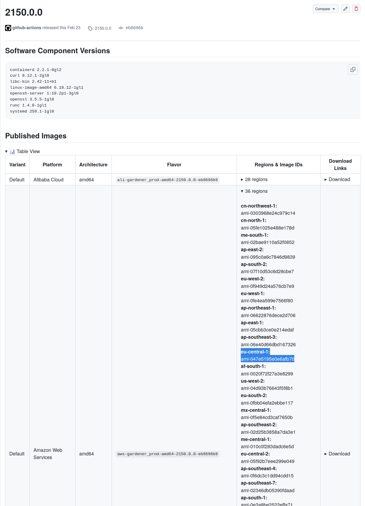

# First Boot on AWS

Garden Linux is a minimal, security-hardened Linux distribution designed for cloud and container environments. This tutorial guides you through deploying your first Garden Linux instance on [AWS](../../reference/glossary.md#aws) EC2, from selecting an Amazon Machine Image (AMI) to connecting via SSH.

**Difficulty:** Beginner | **Time:** ~15 minutes

**Learning Objective:** By the end of this tutorial, you'll have a running Garden Linux instance on AWS and understand the basic deployment process.

## Prerequisites

Before starting, you'll need:

- An AWS account with appropriate permissions to create EC2 instances, VPCs, and security groups
- [AWS CLI](https://aws.amazon.com/cli/) installed and configured with your credentials
- Basic familiarity with EC2 concepts
- An SSH client on your local machine

## What You'll Build

You'll deploy a Garden Linux instance on AWS EC2 with a basic networking setup (VPC, subnet, internet gateway, and security group), configure SSH access, and verify the installation. The tutorial uses the `aws-gardener_prod` [flavor](../../explanation/flavors-and-features.md), which is optimized for gardener production workloads on AWS.

## Steps

### Step 1: Choose an Image

Garden Linux provides pre-built AMIs for multiple AWS regions. Start by selecting an appropriate image for your deployment.

#### Official Images

Choose a release from the [GitHub Releases page](https://github.com/gardenlinux/gardenlinux/releases). For this tutorial, we'll use [release 2150.0.0](https://github.com/gardenlinux/gardenlinux/releases/tag/2150.0.0).

In the "Published Images" section on the release page, find the AMI ID for your desired [flavor](../../explanation/flavors-and-features.md), [architecture](../../reference/glossary.md#architecture), and [region](../../reference/glossary.md#region). The default production flavor is `aws-gardener_prod-amd64`.



For this tutorial, we'll use the `eu-central-1` region. Replace the AMI ID below with the one corresponding to your chosen region:

```bash
AMI_ID="ami-0f502b80bb47d34b3"
```

:::tip
For a complete list of maintained releases and their support lifecycle, see the [releases reference](../../reference/releases/index.md).
:::

#### Build Your Own Images

You can [Build your own Garden Linux Images](/how-to/building-images) or even [Create a custom Feature](/how-to/custom-feature).

### Step 2: Prepare Your AWS Environment

Before launching your Garden Linux instance, set up the necessary AWS networking infrastructure. This step creates a Virtual Private Cloud (VPC), subnet, internet gateway, and security group.

#### Create a VPC

Create a VPC to isolate your Garden Linux instance in a dedicated network environment:

```bash
AWS_REGION="eu-central-1"
VPC_CIDR="10.1.0.0/18"
VPC_ID=$(aws ec2 create-vpc \
    --cidr-block ${VPC_CIDR} \
    --output text --query 'Vpc.VpcId')
```

#### Create a Subnet

Create a subnet within the VPC where your instance will be placed:

```bash
SUBNET_CIDR="10.10.0.0/22"
AZ=$(aws ec2 describe-availability-zones \
    --query 'AvailabilityZones[].ZoneName' \
    --filter "Name=state,Values=available" \
    --output text | tr -s '\t' '\n' | head -1)

SUBNET=$(aws ec2 create-subnet \
            --vpc-id $VPC_ID \
            --availability-zone ${AZ} \
            --cidr-block ${SUBNET_CIDR} \
            --query 'Subnet.SubnetId' \
            --output text)
```

#### Create an Internet Gateway

Create and attach an internet gateway to enable public internet access for your instance:

```bash
IGW_ID=$(aws ec2 create-internet-gateway \
    --query 'InternetGateway.InternetGatewayId' \
    --output text)

aws ec2 attach-internet-gateway \
    --vpc-id $VPC_ID \
    --internet-gateway-id ${IGW_ID}

ROUTE_TABLE_ID=$(aws ec2 describe-route-tables \
        --filters "Name=vpc-id,Values=$VPC_ID" \
        --query 'RouteTables[].RouteTableId' \
        --output text)

aws ec2 create-route \
    --route-table-id ${ROUTE_TABLE_ID} \
    --destination-cidr-block 0.0.0.0/0 \
    --gateway-id ${IGW_ID}
```

#### Create a Security Group

Create a security group to control network access to your instance. This configuration allows all traffic between instances in the same security group and SSH access from your current public IP:

```bash
SECURITY_GROUP_ID=$(aws ec2 create-security-group \
    --vpc-id $VPC_ID \
    --group-name gardenlinux-tutorial \
    --description "Allow SSH Access for Garden Linux Tutorial" \
    --query 'GroupId' \
    --output text)

aws ec2 authorize-security-group-ingress \
    --group-id ${SECURITY_GROUP_ID} \
    --protocol all \
    --port 0 \
    --source-group ${SECURITY_GROUP_ID} \
    --output text

aws ec2 authorize-security-group-ingress \
    --group-id ${SECURITY_GROUP_ID} \
    --protocol tcp \
    --port 22 \
    --cidr $(curl -s ifconfig.me)/32 \
    --output text
```

### Step 3: Configure SSH Access

Generate an SSH key pair and create a user-data script to enable SSH on first boot.

:::warning Garden Linux SSH Default
Garden Linux disables SSH by default for security. You must explicitly enable it using cloud-init user-data when launching the instance.
:::

```bash
KEY_NAME="gardenlinux-tutorial-key"
ssh-keygen -t ed25519 -f ${KEY_NAME} -N ""

aws ec2 import-key-pair \
    --key-name $KEY_NAME \
    --public-key-material fileb://${KEY_NAME}.pub

USER_DATA=user_data.sh
cat >${USER_DATA} <<EOF
#!/usr/bin/env bash

# Enable SSH service on first boot
systemctl enable --now ssh
EOF
```

### Step 4: Launch the Instance

Launch your Garden Linux EC2 instance with the prepared configuration:

```bash
aws ec2 run-instances \
        --image-id ${AMI_ID} \
        --subnet-id ${SUBNET} \
        --instance-type t3.small \
        --user-data file://${USER_DATA} \
        --associate-public-ip-address \
        --security-group-ids ${SECURITY_GROUP_ID} \
        --key-name ${KEY_NAME} \
        --count 1 \
        --tag-specifications "ResourceType=instance,Tags=[{Key=Name,Value=gardenlinux-tutorial}]"
```

### Step 5: Connect to Your Instance

Wait a few moments for the instance to boot, then retrieve its public IP address and connect via SSH:

```bash
INSTANCE_IP=$(aws ec2 describe-instances \
    --filters "Name=tag:Name,Values=gardenlinux-tutorial" \
    --query 'Reservations[].Instances[].PublicIpAddress' \
    --output text)

ssh -i ${KEY_NAME} ec2-user@${INSTANCE_IP}
```

:::tip
Garden Linux uses `ec2-user` as the default SSH username on AWS, consistent with Amazon Linux conventions.
:::

### Step 6: Verify the Installation

Once connected, verify your Garden Linux installation with the following commands:

```bash
# Check OS information
cat /etc/os-release

# Verify kernel version
uname -a

# Check system status
systemctl status

# View network configuration
ip addr show
```

Expected output from `/etc/os-release` should show:

```bash
ID=gardenlinux
NAME="Garden Linux"
VERSION="${GL_VERSION}"
...
```

## Success Criteria

You have successfully completed this tutorial when:

- Your Garden Linux instance is running on AWS
- You can connect via SSH
- You can verify the Garden Linux version using `cat /etc/os-release`

## Cleanup Resources

When you're finished with the tutorial, remove all created resources to avoid ongoing costs. The cleanup process must follow a specific order due to dependencies between resources:

```bash
# Terminate the EC2 instance
aws ec2 terminate-instances \
    --instance-ids $(aws ec2 describe-instances \
        --filters "Name=tag:Name,Values=gardenlinux-tutorial" \
        --query 'Reservations[].Instances[].InstanceId' \
        --output text)

# Wait for the instance to fully terminate before proceeding
aws ec2 wait instance-terminated \
    --instance-ids $(aws ec2 describe-instances \
        --filters "Name=tag:Name,Values=gardenlinux-tutorial" \
        --query 'Reservations[].Instances[].InstanceId' \
        --output text)

# Delete the security group
aws ec2 delete-security-group \
    --group-id ${SECURITY_GROUP_ID}

# Delete the AWS key pair
aws ec2 delete-key-pair \
    --key-name ${KEY_NAME}

# Detach the internet gateway before deleting it
aws ec2 detach-internet-gateway \
    --vpc-id ${VPC_ID} \
    --internet-gateway-id ${IGW_ID}

# Delete the internet gateway
aws ec2 delete-internet-gateway \
    --internet-gateway-id ${IGW_ID}

# Delete the subnet
aws ec2 delete-subnet \
    --subnet-id ${SUBNET}

# Delete the VPC
aws ec2 delete-vpc \
    --vpc-id ${VPC_ID}

# Remove local files
rm ${USER_DATA} ${KEY_NAME} ${KEY_NAME}.pub
```

## Next Steps

Now that you have a running Garden Linux instance on AWS, you can:

- Explore [AWS platform-specific features and configurations](../../how-to/installation/cloud/aws.md)
