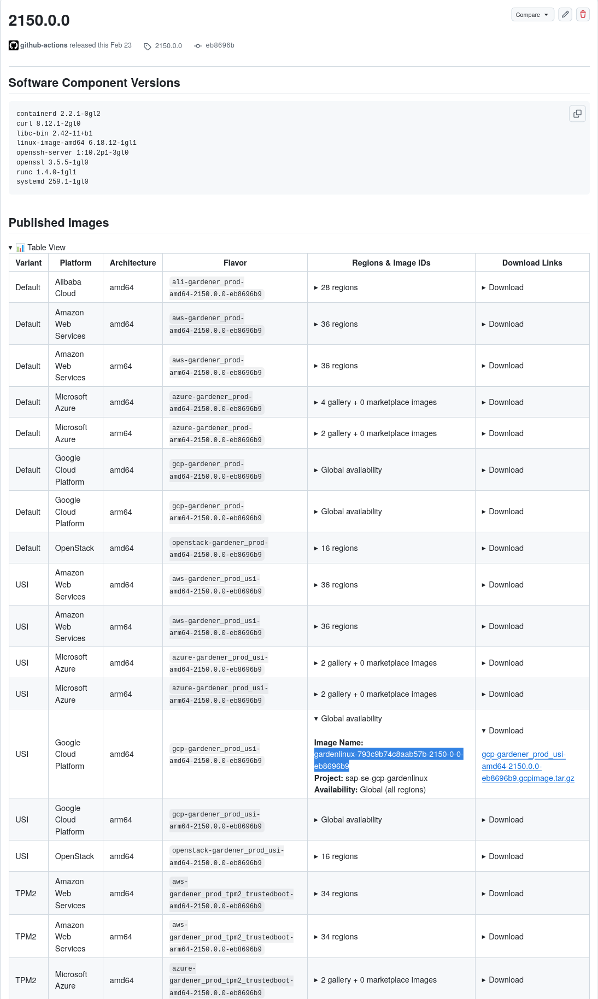

# First Boot on GCP

Garden Linux is a minimal, security-hardened Linux distribution designed for cloud and container environments. This tutorial guides you through deploying your first Garden Linux instance on [Google Cloud Platform](https://cloud.google.com/) (GCP) Compute Engine, from selecting an image to connecting via SSH.

**Difficulty:** Beginner | **Time:** ~15 minutes

**Learning Objective:** By the end of this tutorial, you'll have a running Garden Linux instance on GCP and understand the basic deployment process.

## Prerequisites

Before starting, you'll need:

- A GCP account with appropriate permissions to create Compute Engine instances, VPC networks, and firewall rules
- [Google Cloud CLI](https://cloud.google.com/sdk/docs/install) installed and authenticated with `gcloud auth login`
- A GCP project set with `gcloud config set project <PROJECT_ID>`
- Basic familiarity with GCP concepts
- An SSH client on your local machine

## What You'll Build

You'll deploy a Garden Linux instance on GCP Compute Engine with a basic networking setup (VPC network, subnet, firewall rules, and static external IP), configure SSH access, and verify the installation. The tutorial uses the `gardener_prod` [flavor](/explanation/flavors), which is optimized for production workloads.

## Steps

### Step 1: Choose an Image

Garden Linux provides pre-built images for GCP. You have two options for obtaining an image:

1. **[Use an Official Image](#official-images)** - Reference a pre-published image from the shared Garden Linux GCP project (fastest method)
2. **[Upload a Pre-built Image](#uploading-pre-built-images)** - Download from GitHub releases and upload to your GCP project

:::tip
For a comprehensive overview of all image acquisition methods across platforms, see [Getting Images](/how-to/getting-images).
:::

:::warning
Publishing [official Garden Linux images to cloud provider marketplaces](https://github.com/gardenlinux/gardenlinux/issues/4592) is in progress. If official images are not yet available in the shared GCP project, proceed with [Uploading pre-built images](#uploading-pre-built-images).
:::

#### Official Images

Choose a release from the [GitHub Releases page](https://github.com/gardenlinux/gardenlinux/releases). For this tutorial, we'll use [release 2150.0.0](https://github.com/gardenlinux/gardenlinux/releases/tag/2150.0.0).

In the "Published Images" section on the release page, find the GCP image ID for your desired [flavor](/explanation/flavors), [architecture](/reference/glossary), and region. The default production flavor is `gcp-gardener_prod-amd64`.



Garden Linux publishes images to a shared GCP project. The image follows this format:

```bash
GL_VERSION="2150.0.0"
GL_VERSION_SLUG="${GL_VERSION//./-}"
GL_GCP_PROJECT="sap-se-gcp-gardenlinux"
IMAGE_NAME="projects/${GL_GCP_PROJECT}/global/images/gardenlinux-gcp-gardener_prod-amd64-${GL_VERSION_SLUG}"
```

:::tip
For a complete list of maintained releases and their support lifecycle, see the [releases reference](/reference/releases/).
:::

#### Uploading pre-built images

Choose a release from the [GitHub Releases page](https://github.com/gardenlinux/gardenlinux/releases). For this tutorial, we'll use [release 2150.0.0](https://github.com/gardenlinux/gardenlinux/releases/tag/2150.0.0).

In the "Published Images" section on the release page, find the image for your desired [flavor](/explanation/flavors) and [architecture](/reference/glossary#architecture). The default production flavor is `gcp-gardener_prod-amd64`.

##### Manual download

Click the download link in the "Published Images" table to download the `.gcpimage.tar.gz` image file directly.

##### Download by script

The download URL follows a predictable pattern using the version and commit hash. You can find the commit hash in the flavor name shown in the "Published Images" table (e.g., `gcp-gardener_prod-amd64-2150.0.0-eb8696b9` where `eb8696b9` is the commit).

```bash
GL_VERSION="2150.0.0"
GL_COMMIT="eb8696b9"
GL_ARCH="amd64"
GL_FLAVOR="gcp-gardener_prod"
GL_ASSET="${GL_FLAVOR}-${GL_ARCH}-${GL_VERSION}-${GL_COMMIT}"
GL_GCPIMAGE="${GL_ASSET}.gcpimage.tar.gz"

# Download the image
curl -L -o "${GL_GCPIMAGE}" \
  "https://gardenlinux-github-releases.s3.amazonaws.com/objects/${GL_ASSET}/${GL_GCPIMAGE}"
```

:::tip
Set `GL_ARCH` to `arm64` if you would like to download/upload the arm version.

```bash
GL_ARCH="arm64"
```

:::

:::tip
For a complete list of maintained releases and their support lifecycle, see the [releases reference](/reference/releases/).
:::

##### Upload the image to GCP

Please [Create a Resource Group](#create-a-resource-group) first.

###### Create a Cloud Storage Bucket

Create a Cloud Storage Bucket that holds the Garden Linux image:

```bash
BUCKET="gl-tutorial"
GCP_REGION="europe-west4"

gcloud storage buckets create gs://${BUCKET} --location=${GCP_REGION}
```

###### Upload the image

Upload the image to the bucket:

```bash
gsutil cp ${GL_GCPIMAGE} gs://${BUCKET}
```

###### Register the image

Register the uploaded image:

```bash
IMAGE_NAME="gl-tutorial"
gcloud compute images create ${IMAGE_NAME} \
 --source-uri=gs://${BUCKET}/${GL_GCPIMAGE} \
 --guest-os-features=VIRTIO_SCSI_MULTIQUEUE
```

#### Build Your Own Images

You can [Build your own Garden Linux Images](/how-to/building-images) or even [Create a custom Feature](/how-to/custom-feature).

### Step 2: Prepare Your GCP Environment

Before launching your Garden Linux instance, set up the necessary GCP networking infrastructure. This step creates a virtual network, subnet, firewall rules, and reserves a static pupblic IP address.

#### Create a Virtual Network and Subnet

Create a Virtual Network and Subnet to isolate your Garden Linux instance in a dedicated network environment:

```bash
NETWORK_NAME="gardenlinux-network"
SUBNET_NAME="gardenlinux-subnet"
SUBNET_CIDR="10.1.0.0/24"
GCP_REGION="europe-west4"
GCP_ZONE="${GCP_REGION}-a"

gcloud compute networks create ${NETWORK_NAME} \
    --subnet-mode=custom

gcloud compute networks subnets create ${SUBNET_NAME} \
    --network=${NETWORK_NAME} \
    --region=${GCP_REGION} \
    --range=${SUBNET_CIDR}
```

#### Create a Firewall and Rules

Create a firewall and rules to control network access to your instance. This configuration allows SSH access from your current public IP:

```bash
FW_NAME="gardenlinux-allow-ssh"

# Allow SSH from your current public IP
gcloud compute firewall-rules create ${FW_NAME} \
    --network=${NETWORK_NAME} \
 --allow=tcp:22 \
 --source-ranges=$(curl -s api.ipify.org)/32 \
 --target-tags=gardenlinux-tutorial
```

#### Create a Public IP Address

Create a public IP address to enable public internet access for your instance:

```bash
PIP_NAME="gardenlinux-tutorial-ip"

gcloud compute addresses create ${PIP_NAME} \
    --region=${GCP_REGION}
```

### Step 3: Configure SSH Access

Generate an SSH key pair and create a startup script to enable SSH on first boot.

:::warning Garden Linux SSH Default
Garden Linux disables SSH by default for security. You must explicitly enable it using a startup script when launching the instance.
:::

```bash
KEY_NAME="gardenlinux-tutorial-key"
ssh-keygen -t ed25519 -f ${KEY_NAME} -N ""

USER_DATA=user_data.sh
cat >${USER_DATA} <<EOF
#!/usr/bin/env bash

# Enable SSH service on first boot
systemctl enable --now ssh
EOF
```

### Step 4: Launch the Instance

Launch your Garden Linux GCP Compute Engine instance with the prepared configuration:

```bash
INSTANCE_NAME="gardenlinux-tutorial"
MACHINE_TYPE="e2-small"
PIP=$(gcloud compute addresses describe ${PIP_NAME} \
    --region=${GCP_REGION} \
    --format='get(address)')

gcloud compute instances create ${INSTANCE_NAME} \
    --image=${IMAGE_NAME} \
    --zone=${GCP_ZONE} \
    --machine-type=${MACHINE_TYPE} \
    --subnet=${SUBNET_NAME} \
    --address=${PIP} \
    --tags=gardenlinux-tutorial \
    --boot-disk-size=20GB \
    --metadata=ssh-keys="${SSH_USER}:$(cat ${KEY_NAME}.pub)" \
    --metadata-from-file=startup-script=${USER_DATA}
```

### Step 5: Connect to Your Instance

Wait a few moments for the instance to boot, then retrieve its IP address and connect via SSH:

```bash
INSTANCE_IP=$(gcloud compute instances describe ${INSTANCE_NAME} \
    --zone=${GCP_ZONE} \
    --format='get(networkInterfaces[0].accessConfigs[0].natIP)')

ssh -i ${KEY_NAME} gardenlinux@${INSTANCE_IP}
```

:::tip
Garden Linux uses `gardenlinux` as the default SSH username on GCP. This is different on other platforms. Have a look at the [default usernames per platform](/how-to/installation/cloud-init#default-usernames-per-platform).
:::

### Step 6: Verify the Installation

Once connected, verify your Garden Linux installation with the following commands:

```bash
# Check OS information
cat /etc/os-release

# Verify kernel version
uname -a

# Check system status
systemctl status

# View network configuration
ip addr show
```

Expected output from `/etc/os-release` should show:

```bash
ID=gardenlinux
NAME="Garden Linux"
VERSION="${GL_VERSION}"
...
```

## Success Criteria

You have successfully completed this tutorial when:

- Your Garden Linux instance is running on GCP
- You can connect via SSH
- You can verify the Garden Linux version using `cat /etc/os-release`

## Cleanup Resources

When you're finished with the tutorial, remove all created resources to avoid ongoing costs. The cleanup process must follow a specific order due to dependencies between resources:

```bash
# Delete the instance
gcloud compute instances delete ${INSTANCE_NAME} \
    --zone=${GCP_ZONE} --quiet

# Delete the static IP
gcloud compute addresses delete ${PIP_NAME} \
    --region=${GCP_REGION} --quiet

# Delete the firewall rule
gcloud compute firewall-rules delete ${FW_NAME} --quiet

# Delete the subnet
gcloud compute networks subnets delete ${SUBNET_NAME} \
    --region=${GCP_REGION} --quiet

# Delete the VPC network
gcloud compute networks delete ${NETWORK_NAME} --quiet

# Delete all storage objects and Bucket (if it exists)
test -n ${BUCKET} && gcloud storage rm --recursive gs://${BUCKET} --quiet

# Remove local files
rm ${USER_DATA} ${KEY_NAME} ${KEY_NAME}.pub
```

## Related Topics

<RelatedTopics />
