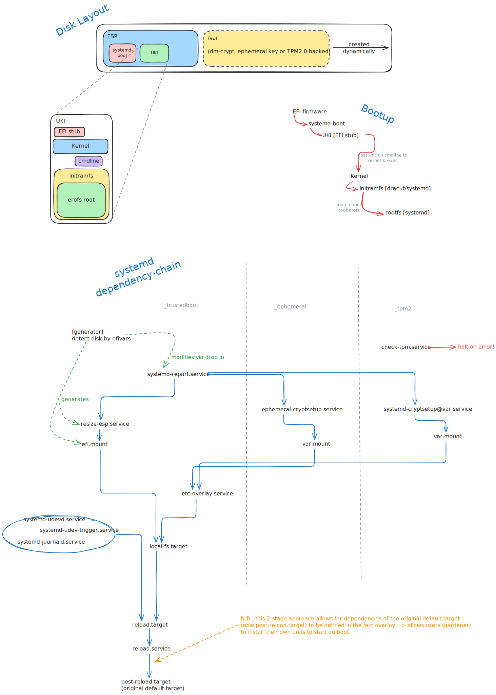

# Trustedboot

Trustedboot is an extension of Secure Boot, extending the security guarantees provided by Secure Boot to the entire boot chain.
While Secure Boot only validates the authenticity of the bootloader and kernel, Trustedboot also ensures the integrity of the root filesystem.

<picture>
<source media="(prefers-color-scheme: dark)" srcset="./trustedboot_architecture_dark.svg">

</picture>

## Architecture

The design is loosely inspired by Lennart Poettering's ideas[^1] on how modern operating systems should boot.
We also fully embrace UKIs[^2] in order to extend the Secure Boot validation to more than just the bootloader and kernel, and we also make use of an immutable root filesystem.
However, the design differs in how the root filesystem is verified.

In Lennart Poettering's design, the root (or just the `/usr` partition) is stored on a dm-verity disk; the root hash of the dm-verity Merkle tree is then embedded into the UKI.
While this design works well, it does add quite a bit of complexity.
It requires at least three partitions (more if you want in-place updates with A/B partitions): EFI system partition, root dm-verity data partition, and root dm-verity hash tree partition.

Due to the incredibly small footprint of our root partition, we can afford to go a different route: we can embed the entire root filesystem into the UKI.
This is done by packing the root filesystem into an EROFS image, which gets embedded into the initrd.

This has the added benefit of significantly simplifying the operation of the initrd.
It no longer needs to detect devices or disks; instead, the job of the initrd is now only to loop mount the embedded EROFS and pass control to it.

### Mutable Data

While an immutable root filesystem provides good security guarantees, it prohibits a lot of operations.
Most systems running on Garden Linux require some form of writable state, usually under `/var`.
Therefore, we mount `/var` as writable.
To allow for modifications in `/etc` we create an overlay mount on top of `/etc`.
This overlay is backed by `/var/etc.overlay`.

For writable `/var`, there are two possible modes of operation:

1. **Ephemeral**: In this mode, a clean partition is created on each boot and encrypted with a per-boot random key.
2. **TPM 2.0 backed**: In this mode, the partition is created on first boot and encrypted with a key stored in the machine's TPM.
   This TPM secret is bound to the machine's Secure Boot state (PCR 7), so it will only allow decryption on subsequent boots if the Secure Boot certificate chain remains unchanged.

In both of these modes of operation, the creation of the `/var` partition is handled by `systemd-repart`, and it automatically uses the available space on whichever disk the ESP is on.

## How to Build & Test on macOS

1. make sure you have build the secureboot certificate chain (`./cert/build`)
2. build an image with the `_trustedboot` flag enabled and optionally the `_tpm2` flag, e.g. `./build kvm_dev_trustedboot_tpm2`
3. get a version of edk2 with secureboot support:
   ```
   mkdir edk2
   podman run --rm -v "$PWD/edk2:/mnt" debian:testing bash -c 'apt update && apt install -y qemu-efi-aarch64 && cp /usr/share/AAVMF/AAVMF_CODE.secboot.fd /usr/share/AAVMF/AAVMF_VARS.fd /mnt/'
   ```
4. boot with `start-vm` (be sure to add the `,qcow=4G` part which is vital to make the disk large enough for the repartition):
   ```
   ./bin/start-vm --ueficode edk2/AAVMF_CODE.secboot.fd --uefivars edk2/AAVMF_VARS.fd --tpm2 disk.qcow2,qcow=4G
   ```


[^1]: https://0pointer.net/blog/fitting-everything-together.html
[^2]: https://uapi-group.org/specifications/specs/unified_kernel_image/
