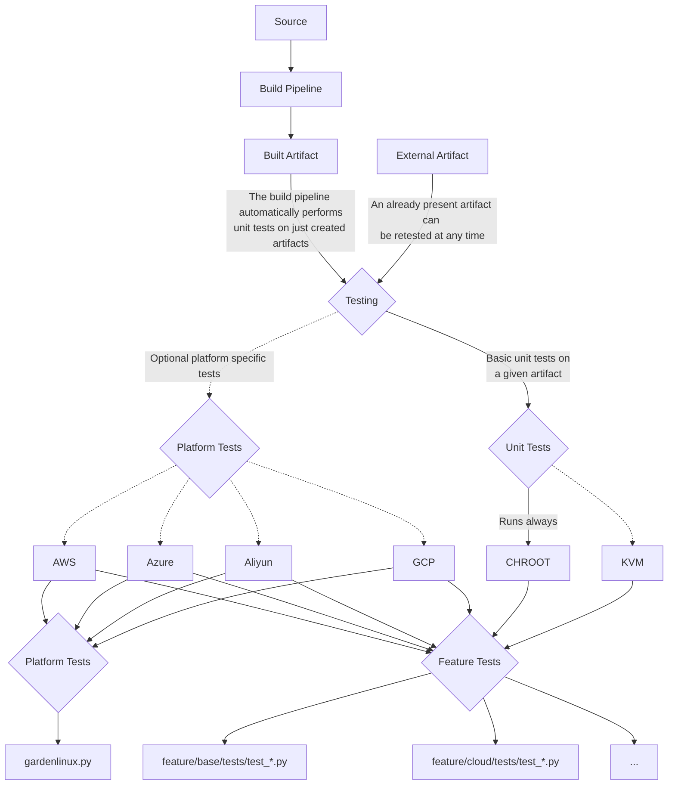

# Tests

# Table of Content

- [Tests](#tests)
- [Table of Content](#table-of-content)
- [General](#general)
- [Chart](#chart)
- [Unit Tests](#unit-tests)
  - [Running Unit tests](#running-unit-tests)
  - [Location of Unit Tests](#location-of-unit-tests)
    - [Example Location](#example-location)
- [Platform Tests](#platform-tests)
  - [Prerequisites](#prerequisites)
  - [Using the tests on supported platforms](#using-the-tests-on-supported-platforms)
    - [General](#general-1)
    - [Public cloud platforms](#public-cloud-platforms)
    - [Local test environments](#local-test-environments)
      - [CHROOT](#chroot)
        - [Configuration options](#configuration-options-1)
        - [Running the tests](#running-the-tests-1)
      - [KVM](#kvm)
        - [Configuration options](#configuration-options-2)
        - [Running the tests](#running-the-tests-2)
      - [Manual Testing](#manual-testing)
        - [Running the tests](#running-the-tests-3)
      - [OpenStack CC EE flavor](#openstack-cc-ee-flavor)
        - [Configuration options](#configuration-options-3)
        - [Running the tests](#running-the-tests-4)
      - [Local tests in the platform container](#local-tests-in-the-platform-container)
        - [Configuration options](#configuration-options-4)
        - [Running the tests](#running-the-tests-5)
  - [Misc](#misc)
    - [Autoformat Using Black](#autoformat-using-black)
    - [Run Static Checks](#run-static-checks)
    - [Shellcheck](#shellcheck)

# General

Garden Linux supports platform testing on all major cloud platforms (Aliyun, AWS, Azure, GCP) as well as regular unit tests. To allow testing even without access to any cloud platform we created an universal `kvm` platform that may run locally and is accessed in the same way via a `ssh client object` as any other cloud platform. Therefore, you do not need to adjust tests to perform local platform tests. Next to this, the `KVM` and `chroot` platform are used for regular `unit tests`. All platforms share Pytest as a common base, are accessed in the same way (via a `RemoteClient` object) and are described in detail below. Beside this, you may also find additional tests that may be used for developing and contributing to fit the Garden Linux style guides.

# Chart
This chart briefly describes the process of unit-, platform/platform tests.



# Unit Tests
Unit testing are used to validate and test the functionality of Garden Linux sources and its whole feature sets. When adding a Garden Linux specific feature like `CIS`, all related `CIS` unit tests are executed. Each feature is represented by unit tests to ensure its conformity. 

## Running Unit tests

To run all unit tests for a Garden Linux image, you can use the command

    ./test ${target}

## Location of Unit Tests
These tests are located in a subfolder (`test`) within a feature's directory and must be prefixed with `test_`. This means, that any feature may provide a subfolder called `test` including their `unit test(s)`. `Pytest` will automatically include these files and validate if they need to run (e.g. `cis` tests will only run if the given artifact was built with this feature).

### Example Location
| Feature | Unit test | Test location |
|---|---|---|
| $FEATURE_NAME | test_$TEST_NAME.py | features/$FEATURE_NAME/test/test_$TEST_NAME.py |
| CIS | test_cis.py | [features/cis/test/test_cis.py](../features/cis/test/test_debian_cis.py) |

# Platform Tests
## Prerequisites
Build the platform test container images with all necessary dependencies. These container images will contain all necessary Python modules as well as the command line utilities by the Cloud providers (i.e. AWS, Azure and GCP) and the OpenTofu binaries.

> [!NOTE]
> For platform tests where the resources are build up with OpenTofu the `gardenlinux/platform-test-tofu` image can be used.

> [!NOTE]
> For `CHROOT` platform tests the `gardenlinux/platform-test-base` image can be used.

    make --directory=tests/images build-platform-test

Many more build targets are available, e.g. to build only for a certain platform.

    ❯ make --directory=tests/images help
    Usage: make [target]

    general targets:
    help					List available tasks of the project                                     
    
    Available targets for Platform Test Images:
    
    all targets:
      pull-platform-test                                                            Pull all platform test images
      build-platform-test                                                           Build all platform test images
      push-platform-test                                                            Push all platform test images
      push-release-platform-test                                                    Push all platform test images with release tag
    
    base targets:
      pull-platform-test-base                                                       Pull the platform test base image
      build-platform-test-base                                                      Build the platform test base image
      push-platform-test-base                                                       Push the platform test base image
      push-release-platform-test-base                                               Push the platform test base image with release tag
    
    platform-specific targets:
      pull-platform-test-kvm                                                        Pull the platform test image for kvm
      pull-platform-test-openstack                                                  Pull the platform test image for openstack
      pull-platform-test-tofu                                                       Pull the platform test image for tofu
      build-platform-test-kvm                                                       Build the platform test image for kvm
      build-platform-test-openstack                                                 Build the platform test image for openstack
      build-platform-test-tofu                                                      Build the platform test image for tofu
      push-platform-test-kvm                                                        Push the platform test image for kvm
      push-platform-test-openstack                                                  Push the platform test image for openstack
      push-platform-test-tofu                                                       Push the platform test image for tofu
      push-release-platform-test-kvm                                                Push the platform test image for kvm with release tag
      push-release-platform-test-openstack                                          Push the platform test image for openstack with release tag
      push-release-platform-test-tofu                                               Push the platform test image for tofu with release tag

The resulting container images will be tagged as `gardenlinux/platform-test-<platform>:<version>` with `<version>` being the version that is passed as $GL_VERSION build argument. By default this is the version that has the `latest` tag in the [github image registry](https://github.com/gardenlinux/gardenlinux/pkgs/container/gardenlinux). In addition to that, tags for the commit hashes also exist.

All further tests run inside containers spawned from these images.

    ❯ podman images | grep gardenlinux/platform-test | grep ghcr
    ghcr.io/gardenlinux/gardenlinux/platform-test-base         1646.0                                    4f333ff23e99  23 hours ago   832 MB
    ghcr.io/gardenlinux/gardenlinux/platform-test-base         1e0d51fe54c6054240e3e0dbb81ce336f6e6ed39  a054fcb817f0  23 hours ago   832 MB
    ghcr.io/gardenlinux/gardenlinux/platform-test-base         1e0d51fe                                  a054fcb817f0  23 hours ago   832 MB
    ghcr.io/gardenlinux/gardenlinux/platform-test-base         32618be8186df52845a10e2c6ab06fd54f8b656a  4f333ff23e99  23 hours ago   832 MB
    ghcr.io/gardenlinux/gardenlinux/platform-test-base         32618be8                                  4f333ff23e99  23 hours ago   832 MB
    ghcr.io/gardenlinux/gardenlinux/platform-test-base         latest                                    0b6832e7a338  6 days ago     832 MB
    ghcr.io/gardenlinux/gardenlinux/platform-test-kvm          1646.0                                    897a857b4150  23 hours ago   1.69 GB
    ghcr.io/gardenlinux/gardenlinux/platform-test-kvm          1e0d51fe                                  00c418132c38  23 hours ago   1.69 GB
    ghcr.io/gardenlinux/gardenlinux/platform-test-kvm          1e0d51fe54c6054240e3e0dbb81ce336f6e6ed39  00c418132c38  23 hours ago   1.69 GB
    ghcr.io/gardenlinux/gardenlinux/platform-test-kvm          32618be8186df52845a10e2c6ab06fd54f8b656a  897a857b4150  23 hours ago   1.69 GB
    ghcr.io/gardenlinux/gardenlinux/platform-test-kvm          32618be8                                  897a857b4150  23 hours ago   1.69 GB
    ghcr.io/gardenlinux/gardenlinux/platform-test-openstack    1646.0                                    802a233b9aeb  23 hours ago   883 MB
    ghcr.io/gardenlinux/gardenlinux/platform-test-openstack    1e0d51fe54c6054240e3e0dbb81ce336f6e6ed39  6a200988c08f  23 hours ago   879 MB
    ghcr.io/gardenlinux/gardenlinux/platform-test-openstack    1e0d51fe                                  6a200988c08f  23 hours ago   879 MB
    ghcr.io/gardenlinux/gardenlinux/platform-test-openstack    32618be8186df52845a10e2c6ab06fd54f8b656a  802a233b9aeb  23 hours ago   883 MB
    ghcr.io/gardenlinux/gardenlinux/platform-test-openstack    32618be8                                  802a233b9aeb  23 hours ago   883 MB
    ghcr.io/gardenlinux/gardenlinux/platform-test-tofu         1679.0                                    c23ac2651b9e  13 days ago    3.64 GB
    ghcr.io/gardenlinux/gardenlinux/platform-test-tofu         80436df06a51f131a4993a2e6e34aabca1654138  c23ac2651b9e  13 days ago    3.64 GB
    ghcr.io/gardenlinux/gardenlinux/platform-test-tofu         80436df0                                  c23ac2651b9e  13 days ago    3.64 GB
    ghcr.io/gardenlinux/gardenlinux/platform-test-tofu         latest                                    c23ac2651b9e  13 days ago    3.64 GB    

## Using the tests on supported platforms

### General

The platform tests require a config file containing vital information for interacting with the cloud providers. In the following sections, the configuration options are described in general and for each cloud provider individually.

Since the configuration options are provided as a structured YAML with the cloud provider name as root elements, it is possible to have everything in just one file.

### Public cloud platforms

These tests test Garden Linux on public cloud providers like Amazons AWS, Googles Cloud Platforms, Microsoft's Azure or Aliyun's Alibaba cloud. You need a valid subscription in these hyperscalers to run the tests. The test's cloud resources are built up with OpenTofu.

Please look at the [OpenTofu Documentation in `tests/platformSetup/tofu`](platformSetup/tofu/README.md) for more details.

### Local test environments

These tests flavors will make use of chroot, KVM virtual machines or OpenStack environments and thus can be used locally without a paid subscription to a public cloud provider.

#### CHROOT

CHROOT tests are designed to run directly on your platform within a `chroot` environment and boosts up the time for the platform tests that do not need any target platform.

<details>
<summary>Click to see the implemenation details of the Pytest configuration.</summary>

> [!NOTE]
> * A local SSH server is started inside the chroot environment. The tests communicate via ssh to execute cmds in the image under test. 
> * CHROOT will run inside your `platform-test` Docker container
> * Podman container needs `SYS_ADMIN`, `MKNOD`, `AUDIT_WRITE` and `NET_RAW` capability
> * Temporary SSH keys are auto generated and injected

Use the following configuration file to proceed; only the path to the TAR image needs to be adjusted:

```yaml
chroot:
    # Path to a final artifact. Represents the .tar.xz archive image file (required)
    image: /gardenlinux/.build/kvm-gardener_prod-amd64-today-local.raw

    # IP or hostname of target machine (required)
    # Default: 127.0.0.1
    ip: 127.0.0.1

    # port for remote connection (required)
    # Default: 2223
    port: 2222

    # list of features that is used to determine the tests to run
    features:
      - "base"

    # SSH configuration (required)
    ssh:
        # Defines path where to look for a given key
        # or to save the new generated one. Take care
        # that you do NOT overwrite your key. (required)
        ssh_key_filepath: /tmp/ssh_priv_key

        # Defines the user for SSH login (required)
        # Default: root
        user: root
```

##### Configuration options

- **features** _(optional)_: If not set, the feature tests will be skipped, if set it must contain a list of features. The tests defined in the listed features will be used. The features used to build the image can be found in the _image\_name_.os-release file in the output directory.
- **ssh_key_filepath** _(required)_: The SSH key that will be injected to the *chroot* and that will be used by the test framework to log on to it. In default, you do **not** need to provide or mount your real SSH key; a new one will be generated and injected by every new run. However, if you really want, a present one can be defined - take care that this will not be overwritten and set `ssh_key_generate` to false.
- **user** _(required)_: The user that will be used for the connection.

</details>

##### Running Chroot tests via make targets

```bash
# list all available build targets
$ make

# Build the image for the flavor you want to test
$ make gcp-gardener_prod-amd64-build

# list all available test targets
$ make --directory=tests

# Run Chroot tests for the flavor you want to test
$ make --directory=tests gcp-gardener_prod-amd64-chroot-test
```

##### Running Chroot tests manually

```bash
./test gcp-gardener_prod-amd64
```

#### QEMU

QEMU tests are designed to run directly on your platform via QEMU/KVM. Currently, AMD64 and ARM64 architectures are supported.

<details>
<summary>Click to see the implemenation details of the Pytest configuration.</summary>

Use the following configuration file to proceed; only the path to the image needs to be adjusted:

```yaml
qemu:
    # Path to a final artifact. Represents the .raw image file (required)
    image: /gardenlinux/.build/kvm-gardener_prod-amd64-today-local.raw

    # IP or hostname of target machine (optional)
    # Default: 127.0.0.1
    #ip: 127.0.0.1

    # port for remote connection (required)
    # Default: 2223
    port: 2223

    # Keep machine running after performing tests
    # for further debugging (optional)
    # Default: false
    #keep_running: false

    # list of features that is used to determine the tests to run
    features:
      - "base"

    # Architecture to boot
    # Default: amd64
    #arch: amd64

    # Hardware accelerator (kvm, hvf, none)
    # Default: Will be auto detected (Fallback: None)
    #accel: kvm

    # SSH configuration (required)
    ssh:
        # Defines if a new SSH key should be generated (optional)
        # Default: true
        ssh_key_generate: true

        # Defines path where to look for a given key
        # or to save the new generated one. Take care
        # that you do NOT overwrite your key. (required)
        ssh_key_filepath: /tmp/ssh_priv_key

        # Defines if a passphrase for a given key is needed (optional)
        #passphrase: xxyyzz

        # Defines the user for SSH login (required)
        # Default: root
        user: root
```

##### Configuration options

- **features** _(optional)_: If not set, the feature tests will be skipped, if set it must contain a list of features. The tests defined in the listed features will be used. The features used to build the image can be found in the _image\_name_.os-release file in the output directory.
- **ssh_key_filepath** _(required)_: The SSH key that will be injected to the .raw image file and that will be used by the test framework to log on to it. In default, you do **not** need to provide or mount your real SSH key; a new one will be generated and injected by every new run. However, if you really want, a present one can be defined - take care that this will not be overwritten and set `ssh_key_generate` to false.
- **arch** _(optional)_: The architecture under which the AMI of the image to test should be registered (`amd64` or `arm64`), must match the instance type, defaults to `amd64` if not specified.
- **accel** _(optional)_: The hardware accelerator to use (`kvm`, `hvf`, `none`). Default: Will be auto detected (Fallback: None).
- **passphrase** _(optional)_: If the given SSH key is protected with a passphrase, it needs to be provided here.
- **user** _(required)_: The user that will be used for the connection.
- **keep_running** _(optional)_: If set to `true`, all tests resources, especially the VM will not get removed after the test (independent of the test result) to allow further debugging. Default: `False`.

</details>

##### Running QEMU tests via make targets

```bash
# list all available build targets
$ make

# Build the image for the flavor you want to test
$ make gcp-gardener_prod-amd64-build

# list all available test targets
$ make --directory=tests

# Create the QEMU resources for the flavor you want to test
$ make --directory=tests/platformSetup gcp-gardener_prod-amd64-qemu-apply

# Run QEMU platform tests for the flavor you want to test
$ make --directory=tests gcp-gardener_prod-amd64-qemu-platform-test

# Optionally: Login to the QEMU VM
$ make --directory=tests/platformSetup gcp-gardener_prod-amd64-qemu-login

# Remove the QEMU resources for the flavor you want to test
$ make --directory=tests/platformSetup gcp-gardener_prod-amd64-qemu-destroy
```

##### Running QEMU tests manually

```
# Start a container with needed credentials and tools
podman run -it \
    -v ${PWD}:/gardenlinux \
    -e TF_* \
    -v ~/.aliyun:/root/.aliyun \
    -e ALIBABA_* \
    -v ~/.aws:/root/.aws \
    -e AWS_* \
    -v ~/.azure:/root/.azure \
    -e azure_* \
    -e ARM_* \
    -e ACTIONS_* \
    -v ~/.config/gcloud:/root/.config/gcloud \
    -e GOOGLE_* \
    -e CLOUDSDK_* \
    --device=/dev/kvm \
    --name qemu-kvm-gardener_prod-amd64 \
    -d --rm --replace \
    ghcr.io/gardenlinux/gardenlinux/platform-test-kvm:latest \
    bash

# Create pytest resources (run inside container)
pytest --provisioner=kvm --configfile=/gardenlinux/tests/config/pytest.qemu.kvm-gardener_prod-amd64.yaml --create-only

# Run tests (run inside container)
pytest --provisioner=kvm --configfile=/gardenlinux/tests/config/pytest.qemu.kvm-gardener_prod-amd64.yaml
```

#### Manual Testing

So for some reason, you do not want to test Garden Linux by using a tool that automatically sets up the testbed in a cloud environment for you.

You rather want to set up a host running Garden Linux yourself, create a user in it, somehow slip in an SSH public key and have a hostname/ip-address you can use to connect. Now all you want is to have the tests run on that host. This section about _Manual testing_ is for you then.

This setup is also used under the hood for the OpenTofu tests.

Use the following (very simple) test configuration:

```yaml
manual:
    # mandatory, the hostname/ip-address of the host the tests should run on
    host:

    # ssh related configuration for logging in to the VM (required)
    ssh:
        # path to the ssh private key file (required)
        ssh_key_filepath: ~/.ssh/id_rsa_gardenlinux_test
        # passphrase for a secured SSH key (optional)
        passphrase:
        # username
        user: admin
```

##### Running the tests

Start Podman container with dependencies:

- mount Garden Linux repository to `/gardenlinux`
- mount SSH keys to `/root/.ssh`
- mount directory with configfile to `/config`

```
podman run -it --rm  -v `pwd`:/gardenlinux -v $HOME/.ssh:/root/.ssh -v ~/config:/config  ghcr.io/gardenlinux/gardenlinux/platform-test-kvm bash
```

Run the tests (be sure you properly mounted the Garden Linux repository to the container and you are in `/gardenlinux/tests`):

    pytest --provisioner=manual --configfile=/config/myconfig.yaml


#### OpenStack CC EE flavor

Obtain credentials by downloading an OpenStack RC file and source it after adding your password to it. Alternatively you could statically add the password to it (environment variable `OS_PASSWORD`) and specify that file in the configuration.

> [!NOTE]
> that the test will not attempt to create networks, security groups, or attached floating IPs to the virtual machines. The security group and network must exist and most likely the test will have to be executed from a machine in the same network.

Use the following test configuration:

```yaml
openstack_ccee:
    # the OpenStack RC filename
    credentials:

    # if an image id is provided the test will not attempt
    # to upload an image
    # image_id: e3685bf1-2b6d-4291-86af-d4a73d54c6bd

    # image file (a vmdk)
    image: <image-file.vmdk>

    # image name is optional, if not provided a name will be chosen
    image_name: platform-test

    # OpenStack flavor (`openstack flavor list`)
    flavor: g_c1_m2

    # security group (must exist)
    security_group: gardenlinux-sg

    # network name (must exist)
    network_name: gardenlinux

    # list of features that is used to determine the tests to run
    features:
      - "base"

    # ssh related configuration for logging in to the VM (required)
    ssh:
        # path to the ssh key file (required)
        ssh_key_filepath: ~/.ssh/id_rsa_gardenlinux_test
        # key name in OpenStack
        key_name: gardenlinux_platform_test
        # passphrase for a secured SSH key (optional)
        passphrase:
        # username used to connect to the Azure instance (required)
        user: gardenlinux

    # keep instance running after tests finishes (optional)
    keep_running: false
```

##### Configuration options

<details>

- **credentials** _(optional)_: the openstack rc file downloaded from the UI with the password added. If unset the test runtime will read the values from the environment

- **image_name** _(optional)_: the image name for the uploaded image. If unset a generic name will be used.
- **image_id** _(optional)_: if specified the tests will use an existing image for the test. No image will be uploaded
- **image** _(optional/required)_: if no **image_id** is specified this must reference the image `vmdk` file.
- **flavor** _(required)_: an existing flavor name (installation specific)
- **security_group** _(required)_: the security group name for the virtual machine
- **network_name** _(required)_: the network name for the virtual machine
- **ssh_key_filepath** _(required)_: The SSH key that will be deployed to the GCE instance and that will be used by the test framework to log on to it. Must be the file containing the private part of an SSH keypair which needs to be generated with `openssh-keygen` beforehand.
- **passphrase** _(optional)_: If the given SSH key is protected with a passphrase, it needs to be provided here.
- **user** _(required)_: The user that will be provisioned to the GCE instance, which the SSH key gets assigned to and that is used by the test framework to log on the Azure instance.

- **keep_running** _(optional)_: if set to `true`, all tests resources, especially the VM will not get removed after the test (independent of the test result) to allow for debugging

</details>

##### Running the tests

Start Podman container with dependencies:

- mount Garden Linux repository to `/gardenlinux`
- mount GCP credentials to `/root/.config`

```
podman run -it --rm  -v `pwd`:/gardenlinux -v $HOME/.config:/root/.config ghcr.io/gardenlinux/gardenlinux/platform-test-openstack bash
```

Run the tests (be sure you properly mounted the Garden Linux repository to the container and you are in `/gardenlinux/tests`):

    pytest --provisioner=openstack-ccee --configfile=/config/mygcpconfig.yaml


#### Local tests in the platform container

Sometimes it is neccessary to run tests locally for build results and not in a chroot or kvm environment that is accessed via ssh. This can be achieved by using the build results in the base-test container with the `local` configuration for `pytest`.

The following describes the configuration needed to run local tests.

```yaml
local:
    # configuration parameters for tests separated by features
    oci:
      # Path to a final artifact. Represents the .tar.xz archive image file (required)
      image: /build/kvm_dev_oci-amd64-today-local.oci.tar.xz
      kernel: /build/kvm_dev_oci-amd64-today-local.vmlinuz

```

##### Configuration options

<details>

- **oci** contains the configuration options for local test `test_oci`
    - **image** the build result image used within the tests
    - **kernel** the name for the builded kernel

Check the [readme](local/README.md) for detailed configuration options of all the local tests.
</details>

##### Running the tests

Start Podman container with dependencies:

- mount Garden Linux repository to `/gardenlinux`

```
podman run -it --rm  -v `pwd`:/gardenlinux ghcr.io/gardenlinux/gardenlinux/platform-test-kvm bash
```

Run the tests (be sure you properly mounted the Garden Linux repository to the container and you are in `/gardenlinux/tests`):

    pytest --provisioner=local --configfile=/config/mylocalconfig.yaml

NOTE: With the `-k EXPRESSION` you can filter the tests by name to only run the tests you want, instead of all local tests. See `pytest --help` for more information.

## Misc
Within this section further tests are listed that may help developing and contributing on Garden Linux. These tests are disjunct from the Garden Linux code itself and may only perform validation on code (like `Shellcheck` or `autopep`).

### Autoformat Using Black

in order to auto format the source code run

    pipenv run black .

### Run Static Checks

    pipenv run flake8 .

### Shellcheck
Shellcheck is a static analysis tool and allows to analyses and validate given scripts. Tests must be executed explicitly via `pytest shellcheck`. This tool is disjunct from Garden Linux itself and can run on any files within the test container. For more details see Shellcheck [shellcheck/README.md](shellcheck/README.md).

    pytest shellcheck --severity=error
